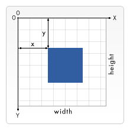

Canvas API 提供了一个通过 JavaScript 和 HTML 的 canvas 元素来绘制图形的方式，可以通过 getContext 获取一个二维渲染上下文

```js
var canvas = document.getElementById('canvas');
var ctx = canvas.getContext('2d');
```

canvas 元素默认被网格所覆盖，网格中一个单元相当于一像素，起点为左上角



#### 绘制形状

常用 api 如下

- beginPath：新建一条路径，生成之后，图形绘制命令作用于之后的这条路径
- closePath：闭合路径之后图形绘制命令又重新指向到上下文中

- stroke：通过线条来绘制图形轮廓
- fill：通过填充路径的内容区域生成实心的图形，所有没有闭合的形状都会自动闭合，无需再调用 closePath

- moveTo：将笔触移动到指定的坐标
- lineTo：绘制一条从当前位置到指定坐标的直线

- strokeRect：绘制一个矩形的边框
- fillRect：绘制一个填充的矩形
- clearRect：清除指定矩形区域，让清除部分完全透明

- arc：绘制圆弧或者圆
- ellipse：绘制椭圆

- quadraticCurveTo：[二次贝塞尔曲线](http://blogs.sitepointstatic.com/examples/tech/canvas-curves/quadratic-curve.html)
- bezierCurveTo：[三次贝塞尔曲线](http://blogs.sitepointstatic.com/examples/tech/canvas-curves/bezier-curve.html)

```js
function draw() {
  const canvas = document.getElementById('canvas');
  const ctx = canvas.getContext('2d');
  // 直线
  ctx.moveTo(10, 50);
  ctx.lineTo(150, 50);
  ctx.stroke();
  // 三角形
  ctx.beginPath();
  ctx.moveTo(10, 80);
  ctx.lineTo(150, 80);
  ctx.lineTo(10, 120);
  ctx.fill();
  // 矩形
  ctx.fillRect(10, 150, 100, 100);
  ctx.clearRect(45, 185, 30, 30);
  // 圆
  ctx.beginPath();
  ctx.arc(55, 325, 50, 0, 2 * Math.PI, false); // 圆心x、圆心y、半径、开始弧度、结束弧度、顺/逆时针
  ctx.stroke();
  // 二次贝塞尔曲线
  ctx.moveTo(10, 400);
  ctx.quadraticCurveTo(300, 300, 200, 420); // 控制点x、控制点y、结束点x、结束点y
  ctx.stroke();
}
```

#### 绘制样式

- 线条

  - lineWidth：线条粗细，默认为 1
  - lineCap：线段端点样式
  - lineJoin：线段连接处样式
  - miterLimit：限制当两条线相交时交接处最大长度，配合 lineJoin=‘miter’使用
  - setLineDash：设置虚线样式
  - lineDashOffset：虚线样式起始偏移量

- 透明度：使用 globalAlpha 或指定带有透明度的色彩

- 色彩：

  - fillStyle：填充颜色
  - strokeStyle：轮廓颜色

- 渐变

  - createLinearGradient：线性渐变
  - createRadialGradient：径向渐变

- 背景图

  - createPattern：图案样式
  - drawImage：绘制图片，支持缩放、裁剪

- 阴影

  - shadowOffsetX、shadowOffsetY：阴影偏移量
  - shadowBlur：阴影模糊程度
  - shadowColor：阴影颜色

#### 绘制文本

- 绘制方式

  - strokeText：描边文本
  - fillText：填充文本

- 文本样式，包括 font、textAlign、direction（文本方向）、textBaseline（垂直方向对齐方式）

- 预测量文本宽度：measureText

#### 变形

##### 状态的保存和恢复

save 和 restore 用来保存和恢复 canvas 的状态，Canvas 的状态是存储在栈中的，save 和 restore 对应入栈和出栈的操作，其中状态指的是

- 应用的变形：移动、旋转、缩放、strokeStyle、fillStyle、globalAlpha、lineWidth、lineCap、lineJoin、miterLimit、lineDashOffset、shadowOffsetX、shadowOffsetY、shadowBlur、shadowColor、globalCompositeOperation、font、textAlign、textBaseline、direction、imageSmoothingEnabled 等
- 应用的裁切路径：clipping path

##### 移动、旋转和缩放

- translate：移动
- rotate：顺时针旋转，旋转的中心点始终是 canvas 的原点
- scale：缩放，如果是负值的话，则是一个镜像的效果

##### transform

- transform：将当前的变形矩阵乘上一个基于自身参数的矩阵
- setTransform：先重置为单位矩阵，再调用 transform
- resetTransform：重置为单位矩阵

#### 合成与裁剪

- 合成：合成的图形受限于绘制的顺序，如果我们不想受限于绘制的顺序，可以设置 globalCompositeOperation
- 裁剪：将当前正在构建的路径转换为当前的裁剪路径

#### 动画

可以通过以下的步骤来画出一帧

- 使用 clearRect 清空 canvas 上一帧的画面
- 保存 canvas 状态
- 绘制动画图形
- 恢复 canvas 状态，然后绘制下一帧

示例如下，一条控制点不断移动的贝塞尔曲线

```js
const canvas = document.getElementById('canvas');
const ctx = canvas.getContext('2d');
function draw() {
  ctx.clearRect(0, 0, 500, 500);
  ctx.save();
  // 每次执行开始一条新路径，否则线条会连成一片
  ctx.beginPath();
  if (y === 500) {
    flag = false;
  }
  if (y === 0) {
    flag = true;
  }
  flag ? y++ : y--;
  ctx.moveTo(0, 250);
  ctx.quadraticCurveTo(250, y, 500, 250); // 控制点x、控制点y、结束点x、结束点y
  ctx.stroke();
  ctx.restore();
  requestAnimationFrame(draw);
}
requestAnimationFrame(draw);
```

再如一个弹跳的小球

```js
const canvas = document.getElementById('canvas');
const ctx = canvas.getContext('2d');
const ball = {
  x: 100,
  y: 100,
  vx: 1,
  vy: 3,
  radius: 25,
  color: 'blue',
  draw: function () {
    ctx.beginPath();
    ctx.arc(this.x, this.y, this.radius, 0, Math.PI * 2, true);
    ctx.closePath();
    ctx.fillStyle = this.color;
    ctx.fill();
  },
};
function draw() {
  // 用带透明度的矩形代替清空，并形成拖尾效果
  ctx.fillStyle = 'rgba(255, 255, 255, 0.3)';
  ctx.fillRect(0, 0, canvas.width, canvas.height);
  ball.draw();
  // 添加加速度
  ball.vy *= 0.995;
  ball.vy += 0.15;
  // 添加速率
  ball.x += ball.vx;
  ball.y += ball.vy;
  // 添加边界
  if (ball.y + ball.vy > canvas.height || ball.y + ball.vy < 0) {
    ball.vy = -ball.vy;
  }
  if (ball.x + ball.vx > canvas.width || ball.x + ball.vx < 0) {
    ball.vx = -ball.vx;
  }
  requestAnimationFrame(draw);
}
requestAnimationFrame(draw);
```

#### 像素操作

ImageData 对象中存储着 canvas 对象真实的像素数据，其 data 属性是 Uint8ClampedArray 类型的一维数组，包含着 RGBA 格式的整型数据

- createImageData：创建一个空白的 ImageData 对象
- getImageData：获取像素数据
- putImageData：进行像素数据的写入

利用像素操作可以实现颜色拾取、颜色灰度和反相等处理，颜色拾取示例如下

```js
function pick(event, destination) {
  var x = event.layerX;
  var y = event.layerY;
  var pixel = ctx.getImageData(x, y, 1, 1);
  var data = pixel.data;

  const rgba = `rgba(${data[0]}, ${data[1]}, ${data[2]}, ${data[3] / 255})`;
  destination.style.background = rgba;
  destination.textContent = rgba;

  return rgba;
}

canvas.addEventListener('mousemove', function (event) {
  pick(event, hoveredColor);
});
canvas.addEventListener('click', function (event) {
  pick(event, selectedColor);
});
```

此外还可以将画布转换成图片

- toDataURL
- toBlob

当然实际项目中使用 canvas 绘图可以使用第三方库，如 zrender、konva 等
