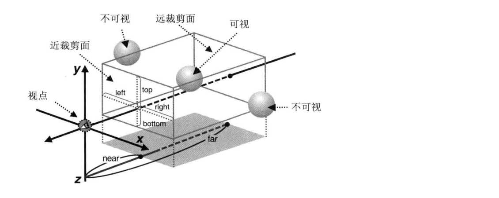
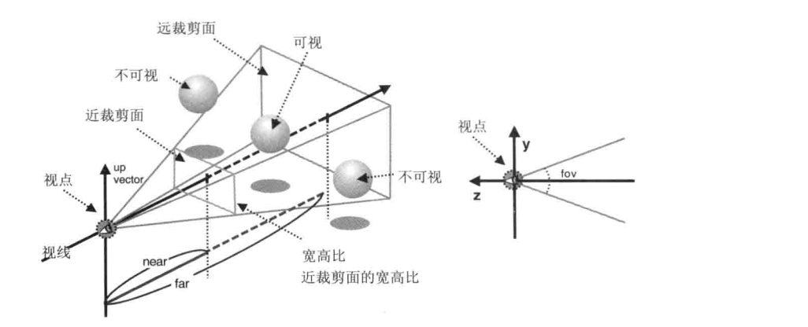

#### 视图矩阵

webgl 中的三维物体都是由三角形组成，相比于二维，还要考虑深度信息，也就是 z 轴，最后还要把三维场景绘制到二维的屏幕上，即观察者看到的世界，有了以下两个概念

- 视点：观察者所处位置
- 视线：从视点出发沿观察方向的射线

为了确定观察者的状态，需要借助三个信息，这些信息会形成一个视图矩阵

- 视点：观察者在三维空间中的坐标
- 观察目标点：视线从视点出发，穿过观察目标的那个点
- 上方向：绘制在屏幕中向上的方向，如果只确定了视点和观察点，观察者是可以以视线为轴旋转的，相当于要确定一个纵向的位置

在 webgl 中观察者的默认状态是这样的：视点位于原点（0，0，0）；视线为 z 负半轴；观察点位于（0，0，-1），上方向为（0，1，0）

部分代码如下

```c
// 顶点着色器
attribute vec4 a_Position;
uniform mat4 u_ViewMatrix;
void main() {
    gl_Position = u_ViewMatrix * a_Position;
}
```

```js
// 顶点数据
const positions = new Float32Array([
  // ...
]);
const buffer = gl.createBuffer();
gl.bindBuffer(gl.ARRAY_BUFFER, buffer);
gl.bufferData(gl.ARRAY_BUFFER, positions, gl.STATIC_DRAW);
// ...
const u_ViewMatrix = gl.getUniformLocation(gl.program, 'u_ViewMatrix');
// 借助 cuon-matrix-ts 库生成视图矩阵
const viewMatrix = new Matrix4();
// 依次传入视点、观察目标点、上方向
viewMatrix.setLookAt(0.25, 0.25, 0.25, 0, 0, 0, 0, 0, 1);
gl.uniformMatrix4fv(u_ViewMatrix, false, viewMatrix.elements);
// ...
gl.drawArrays(gl.TRIANGLES, 0, 9);
```

不难发现，构建三维物体时顶点着色器的行为和进行旋转、平移时使用变换矩阵计算时是一样的，也就是说，根据观察者状态绘制其看到的景象和使用默认观察状态然后再平移、旋转等变换所得到的景象，两者是等价的

我们可以指定某个观察者状态来观察经过平移、旋转等变换后的物体，那么计算顶点坐标时有了以下公式，其中模型矩阵是指平移、缩放等组合起来的矩阵

```
<从视点看上去的旋转后的顶点坐标> = <视图矩阵> * <模型矩阵> * <原始顶点坐标>
```

#### 可视空间

wegbl 只绘制可视范围内的三维对象，包括水平视角、垂直视角、可见深度，这三者构成了可视空间

##### 正射投影

长方体可视空间（盒状空间）由正射投影产生，特点是看上去的大小与所在位置没有关系，其可视空间前后两个矩形决定，分别为近裁剪面和远裁剪面



canvas 上显示的就是可视空间物体在近裁剪面上的投影，如果近裁剪面和 canvas 的宽高比不一样，就会按 canvas 的宽高比进行压缩

类似的，借助正射投影矩阵来实现，通过按键控制近远裁剪面的位置，从而显示或隐藏某些元素

```c
// 顶点着色器
attribute vec4 a_Position;
uniform mat4 u_ProjMatrix;
void main() {
    gl_Position = u_ProjMatrix * a_Position;
}
```

```js
//...
const u_ProjMatrix = gl.getUniformLocation(gl.program, 'u_ProjMatrix');
const matrix = new Matrix4();

draw();

document.onKeydown = (e) => {
  keydown(e);
};

// 视点与近、远裁剪面的距离
const near = 0;
const far = 0.5;
function keydown(e) {
  switch (e.keyCode) {
    case 39:
      near += 0.01;
      break;
    case 37:
      near -= 0.01;
      break;
    case 38:
      far += 0.01;
      break;
    case 40:
      far -= 0.01;
      break;
    default:
      return;
  }
  draw();
}

function draw() {
  // 设置正射投影矩阵
  // 参数依次为左右上下边界、近远裁剪面的位置
  matrix.setOrtho(-1, 1, -1, 1, near, far);
  gl.uniformMatrix4fv(u_ProjMatrix, false, matrix.elements);
  gl.clear(gl.COLOR_BUFFER_BIT);
  gl.drawArray(gl.TRIANGLES, 0, 9);
}
```

当发现图形的某个部分被遮挡了，需要左乘正射投影矩阵来调整可视空间

```
<从视点看上去的旋转后的顶点坐标> = <正射投影矩阵> * <视图矩阵> * <模型矩阵> * <原始顶点坐标>
```

##### 透视投影

使用透视投影可视空间会使场景有深度感，即越远的物体看上去越小



```js
const matrix = new Matrix4();
// 参数依次为可视空间顶面与底面的夹角、近裁剪面宽高比、近远裁剪面位置
matrix.setPerspective(30, canvas.width / canvas.height, 1, 100);
```

同样借助透视投影矩阵实现，实质上透视投影矩阵等价于对物体做了两次变换：根据物体与视点的距离，按比例进行了缩小；对物体平移使其贴近视线

#### 隐藏面消除

webgl 默认情况下按缓冲区中数据的顺序绘制，但是如果不断移动视点，从不同角度观察物体，就无法事先排列好顶点数据

为了解决这个问题，webgl 提供了隐藏面消除的功能，开启后远处的物体自动被近处物体遮挡。每一帧绘制前都要执行以下代码

```js
// 开启隐藏面消除
gl.enable(gl.DEPTH_TEST);
// 清除颜色和深度缓冲区
gl.clear(gl.DEPTH_BUFFER_BIT | COLOR_BUFFER_BIT);
```

其中，深度缓存区是一个中间对象，用来进行隐藏面消除，存储深度信息

#### 深度冲突

当物体两个表面极为接近时，会使表面看起来斑斑驳驳，这种现象称为深度冲突，原因在于深度缓存区精度有限，无法区分哪个在前哪个在后

为了解决这个问题，webgl 提供了多边形偏移的功能，自动在 z 值加一个偏移量

```js
// 开启多边形偏移
gl.enable(gl.POLYGON_OFFSET_FILL);
// 偏移量为m * factor + r * uint，m是顶点所在表面相对于观察者视线的角度，r是两个z值之差的最小值
gl.polygenOffset(factor, uint);
```

#### 绘制立方体

绘制立方体时，每个面由两个三角形组成，每个三角形三个顶点，使用 gl.drawArrays 需要 36 个顶点。为避免重复定义顶点，使用 gl.drawElements 按索引绘制，先确定好立方体的 8 个顶点，然后每个面取其中 6 个点的索引

部分代码如下

```c
// 顶点着色器
attribute vec4 a_Position;
uniform mat4 u_Matrix;
void main() {
    gl_Position = u_Matrix * a_Position;
}
```

```js
function initBuffer() {
  // ...
  // 坐标和颜色
  const verticesColors = new Float32Array([
    1,
    1,
    1,
    1,
    1,
    1, // v0
    -1,
    1,
    1,
    1,
    0,
    1, // v1
    1,
    -1,
    1,
    1,
    0,
    0, // v2
    1,
    -1,
    1,
    1,
    1,
    0, // v3
    1,
    -1,
    -1,
    0,
    1,
    0, // v4
    1,
    1,
    -1,
    0,
    0,
    1, // v5
    1 - 1,
    1,
    -1,
    0,
    0,
    1, // v6
    -1,
    -1,
    -1,
    0,
    0,
    0, // v7
  ]);
  // 索引
  const indices = new Uint8Array([
    0,
    1,
    2,
    0,
    2,
    3, // 前
    4,
    6,
    5,
    4,
    7,
    6, // 后
    1,
    6,
    7,
    1,
    7,
    2, // 左
    0,
    3,
    4,
    0,
    4,
    5, // 右
    0,
    5,
    6,
    0,
    6,
    1, // 上
    7,
    4,
    3,
    7,
    3,
    2, // 下
  ]);
  // 创建缓冲区对象
  const vertColorBuffer = gl.creattBuffer();
  const indiceBuffer = gl.creattBuffer();
  // 写入缓冲区
  gl.bindBuffer(gl.ARRAY_BUFFER, vertColorBuffer);
  gl.bufferData(gl.ARRAY_BUFFER, verticesColors, gl.STATIC_DRAW);
  const FSIZE = verticesColors.BYTES_PER_ELEMENT;
  // 向顶点着色器传递数据
  const a_Position = gl.getUniformLocation(gl.program, 'a_Position');
  gl.vertexAttribPointer(a_Position, 3, gl.FLOAT, false, 6 * FSIZE, 0);
  gl.enablevertexAttribArray(a_Position);
  const a_Color = gl.getUniformLocation(gl.program, 'a_Color');
  gl.vertexAttribPointer(a_Color, 3, gl.FLOAT, false, 6 * FSIZE, 3 * FSIZE);
  gl.enablevertexAttribArray(a_Color);

  // 写入缓冲区
  gl.bindBuffer(gl.ARRAY_BUFFER, indiceBuffer);
  gl.bufferData(gl.ARRAY_BUFFER, indices, gl.STATIC_DRAW);
  return indices.length;
}

function main() {
  // 设置坐标和颜色
  const n = initBuffer();
  // 。。。
  // 开启隐藏面消除
  gl.enable(gl.DEPTH_TEST);
  // 清除颜色和深度缓冲区
  gl.clear(gl.DEPTH_BUFFER_BIT | COLOR_BUFFER_BIT);
  // 设置背景色
  gl.clearColor(0, 0, 0, 1);
  // ...
  const matrix = new Matrix4();
  // 设置视点
  matrix.lookAt(3, 3, 7, 0, 0, 0, 0, 1, 0);
  // 设置可视空间
  matrix.setPerspective(30, 1, 1, 100);
  // 传递给顶点着色器
  const u_Matrix = gl.getUniformLocation(gl.program, 'u_Matrix');
  gl.uniformMatrix4fv(u_Matrix, false, matrix.elements);
  gl.drawElements(gl.TRIANGLES, n, gl.UNSIGNED_BYTE, 0);
}
```

调用 gl.drawElements 时，webgl 首先从绑定 gl.ELEMENT_ARRAY_BUFFER 的缓冲区获取索引，然后根据索引从绑定 gl.ARRAY_BUFFER 的缓冲区中获取坐标和颜色，传递给顶点着色器并执行

上述程序构建了一个根据顶点颜色渐变的立方体，如果想为每个面指定颜色，需要每个面都指向不同的顶点，不存在顶点共享的情况。以上面的立方体为例，不顶点共享的话，每个面 4 个点，需要 24 个顶点
