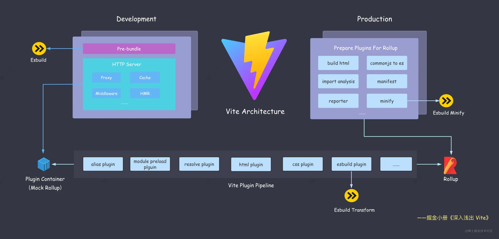

Vite 是基于 Esbuild 和 Rollup 实现的

#### Esbuild

##### 依赖预构建

将其他格式转换为 esm 格式，打包第三方库代码。Esbuild 虽然性能及其优越，但也存在一些缺点

- 不支持降级到 ES5 的代码
- 不支持 const enum 等语法
- 不提供操作打包产物的接口
- 不支持自定义 Code Splitting 策略

这就导致生产环境出于稳定性考虑采用功能更加丰富、生态更加成熟的 Rollup 作为依赖打包工具

##### 单文件编译

在 TS(X)/JS(X) 单文件编译上面也使用 Esbuild 进行语法转译，替换原先 Babel 或者 TSC 的功能。虽然带来了巨大的性能提升，但是 Esbuild 并没有实现 TS 的类型系统，没有能力做类型检查。最终 vite build 时会先执行 tsc 进行类型检查

##### 代码压缩

之前一般使用 Terser 进行代码压缩，但是 Terser 很慢

- 压缩这项工作涉及大量 AST 操作，并且在传统的构建流程中，AST 在各个工具之间无法共享，造成了很多重复解析的过程
- JS 本身属于解释性 + JIT（即时编译） 的语言，对于压缩这种 CPU 密集型的工作，其性能远远比不上 Golang 这种原生语言

Esbuild 这种从头到尾共享 AST 以及原生语言编写的 Minifier 在性能上是及其优越的，效率是 Terser 的二三十倍，它作为插件融入到了 Rollup 的打包流程中

#### Rollup

##### 生产环境打包

Vite 基于 Rollup 本身成熟的打包能力进行扩展和优化，主要包括三个方面

- CSS 代码分割：如果某个异步模块中引入了一些 CSS 代码，Vite 就会自动将这些 CSS 抽取出来生成单独的文件，提高线上产物的缓存复用率

- 自动预加载。Vite 会自动为入口 chunk 的依赖自动生成预加载标签<link rel="moduelpreload">

- 异步 Chunk 加载优化，会预加载异步 Chunk 的依赖

##### 兼容插件机制

Vite 实现了一个 Plugin Container，用来模拟 Rollup 调度各个 Vite 插件的执行逻辑
