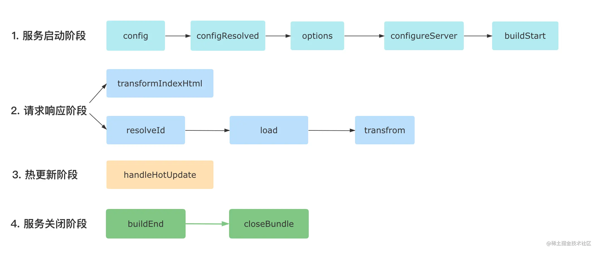

Vite 插件与 Rollup 插件结构，示例如下

```js
// myPlugin.js
export function myVitePlugin(options) {
  console.log(options);
  return {
    name: 'vite-plugin-xxx',
    // 各种hook函数
    load(id) {},
  };
}

// 使用方式
// vite.config.ts
import { myVitePlugin } from './myVitePlugin';
export default {
  plugins: [
    myVitePlugin({
      /* 给插件传参 */
    }),
  ],
};
```

#### 常用 hook

- config：对配置文件导出的对象进行自定义的操作

```js
const editConfigPlugin = () => ({
  name: 'vite-plugin-modify-config',
  config: () => ({
    alias: {
      react: require.resolve('react'),
    },
  }),
});
```

- configResolved：记录最终配置

```js
const exmaplePlugin = () => {
  let config;

  return {
    name: 'read-config',

    configResolved(resolvedConfig) {
      // 记录最终配置
      config = resolvedConfig;
    },

    // 在其他钩子中可以访问到配置
    transform(code, id) {
      console.log(config);
    },
  };
};
```

- configureServer：获取 Dev Server 实例，用于增加自定义 server 中间件

```js
const myPlugin = () => ({
  name: 'configure-server',
  configureServer(server) {
    // 姿势 1: 在 Vite 内置中间件之前执行
    server.middlewares.use((req, res, next) => {
      // 自定义请求处理逻辑
    });
    // 姿势 2: 在 Vite 内置中间件之后执行
    return () => {
      server.middlewares.use((req, res, next) => {
        // 自定义请求处理逻辑
      });
    };
  },
});
```

- transformIndexHtml：拿到原始的 html 内容后进行任意的转换

```js
const htmlPlugin = () => {
  return {
    name: 'html-transform',
    transformIndexHtml(html) {
      return html.replace(
        /<title>(.*?)</title>/,
        `<title>换了个标题</title>`
      )
    }
  }
}
```

#### 其他

各个插件 hook 的执行顺序如下



此外，还可以通过 apply 属性指定插件被用于开发环境还是生产环境，通过 enforce 属性指定插件执行的顺序

借助 vite-plugin-inspect 插件可以进行调试，查看项目中各个模块的编译结果

参考

1. [插件流水线：从整体到局部，理解 Vite 的核心编译能力](https://juejin.cn/book/7050063811973218341/section/7066617652487127077?enter_from=search_result)
2. [插件开发与实战: 如何开发一个完整的 Vite 插件？](https://juejin.cn/book/7050063811973218341/section/7065976180125466638?enter_from=search_result)
