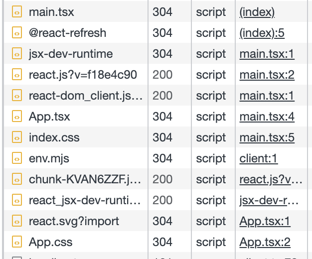

#### 初始化项目

首先初始化项目

```bash
npm i -g pnpm
# 国内镜像源，速度更快
pnpm config set registry https://registry.npmmirror.com/
pnpm create vite
```

在 Vite 项目中，一个 import 语句即代表一个 HTTP 请求，Vite Dev Server 会读取本地文件，返回浏览器可以解析的代码



配置文件 vite.config.ts 示例如下

```js
import { defineConfig } from 'vite';
import react from '@vitejs/plugin-react';

// https://vitejs.dev/config/
export default defineConfig({
  plugins: [react()],
});
```

#### 样式方案

以 sass 为例，开箱即用，安装后就可以使用了，并支持其他配置，示例如下

```js
import { normalizePath } from 'vite';
import path from 'path';

const variablePath = normalizePath(path.resolve('./src/variable.scss'));

export default defineConfig({
  // css 相关的配置
  css: {
    preprocessorOptions: {
      scss: {
        // additionalData 的内容会在每个 scss 文件的开头自动注入
        additionalData: `@import "${variablePath}";`,
      },
    },
  },
});
```

CSS Modules 也是开箱即用的，对后缀带有.module 的样式文件自动应用 CSS Modules，也可以进行配置

```js
export default {
  css: {
    modules: {
      // 一般我们可以通过 generateScopedName 属性来对生成的类名进行自定义
      // 其中，name 表示当前文件名，local 表示类名
      generateScopedName: '[name]__[local]___[hash:base64:5]',
    },
    preprocessorOptions: {
      // 省略预处理器配置
    },
  },
};
```

PostCSS 后处理器配置示例如下

```js
import autoprefixer from 'autoprefixer';

export default {
  css: {
    // 进行 PostCSS 配置
    postcss: {
      plugins: [
        autoprefixer({
          // 指定目标浏览器
          overrideBrowserslist: ['Chrome > 40', 'ff > 31', 'ie 11'],
        }),
      ],
    },
  },
};
```

#### 代码规范

- eslint

通过 Vite 插件的方式在开发阶段进行 ESLint 扫描，以命令行的方式展示出代码中的规范问题，并能够直接定位到原文件

```js
import viteEslint from 'vite-plugin-eslint';

export default {
  plugins: [
    viteEslint(),
  ];
}
```

- stylelint

```js
import viteStylelint from '@amatlash/vite-plugin-stylelint';

export default {
  plugins: [
    // 省略其它插件
    viteStylelint({
      // 对某些文件排除检查
      exclude: /windicss|node_modules/,
    }),
  ],
};
```

#### 静态资源加载

- 图片、json、媒体类文件、字体类文件、文本类文件无需配置，可直接 import 引入
- svg：React 项目使用 vite-plugin-svgr 插件，就可以以组件的形式引入 svg
- Web Worker 脚本：引入时文件名后加?worker 就可以解析

#### 生产环境处理

- 自定义部署域名

可以在项目根目录新增的两个环境变量文件.env.development 和.env.production，分别在开发环境和生产环境注入一些环境变量。浏览器环境下可以通过 import.meta.env 获取环境变量

```js
// vite.config.ts
// 是否为生产环境，在生产环境一般会注入 NODE_ENV 这个环境变量，见下面的环境变量文件配置
const isProduction = process.env.NODE_ENV === 'production';
// 填入项目的 CDN 域名地址
const CDN_URL = 'xxxxxx';

// 具体配置
{
  base: isProduction ? CDN_URL : '/';
}

// .env.development
NODE_ENV = development;

// .env.production
NODE_ENV = production;
```

- 单文件还是内联

Vite 中内置的优化方案是，如果静态资源体积 >= 4KB 就提取成单独的文件，否则作为 base64 格式的字符串内联，可以通过 build.assetsInlineLimit 配置

- 图片压缩

利用图片压缩库 imagemin 对应的 vite 插件 vite-plugin-imagemin
