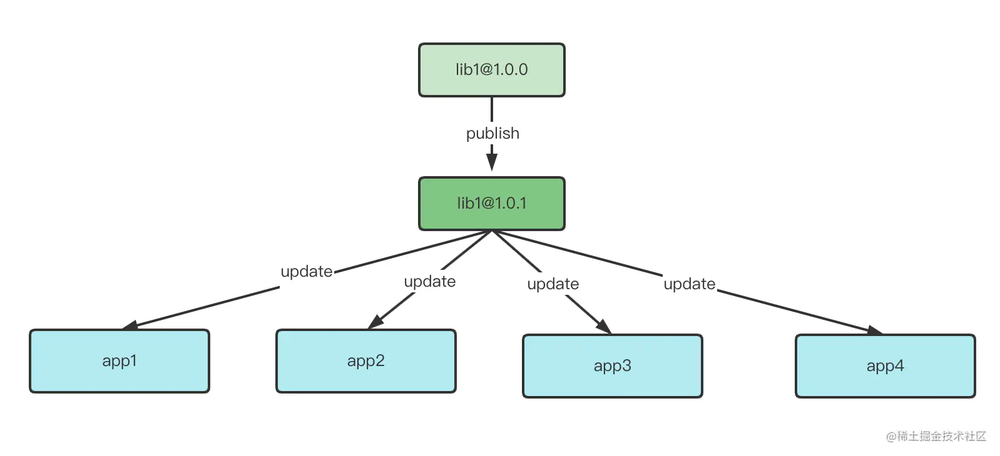

#### 模块共享的方式

- 发布 npm 包：将公共代码发布为 npm 包，然后应用里再安装依赖。缺点在于代码改动后需要重新发版，相关应用也需要更新依赖，也增加了项目打包的体积



- umd 方式共享模块：某些第三方依赖可以不参与打包构建中，而是引入 cdn 依赖地址，其产物是 umd 格式，这样可以直接在 window 对象下获取。缺点在于并不是所有第三方依赖都有 umd 产物，还存在依赖顺序问题，产物只能全量引入的问题

- monorepo：在 Monorepo 架构下，多个项目可以放在同一个 Git 仓库中，各个互相依赖的子项目通过软链的方式进行调用。缺点在于所有代码必须在一个代码库中，随着项目迭代依赖安装和发布构建时间会越来越长

- 模块联邦

#### 概念

模块联邦中主要有两种模块

- 本地模块：当前构建流程中的一部分，也可以作为远程模块被其他模块导入
- 远程模块：不属于当前构建流程，在本地模块运行时导入，本地模块和远程模块可以共享某些依赖的代码

主要有以下优势

- 实现任意粒度的模块共享，包括业务组件、工具函数、整个前端应用
- 优化构建产物体积，远程模块在本地模块运行时被拉取，不参与构建
- 运行时按需加载

模块联邦只有一个在线版本，如果需要版本管理发布 npm 包的方式更合适。这一点类似于微前端，但是粒度更细

#### 使用

1. 项目 A 暴露远程模块

```js
// webpack.config.js
module.exports = {
  // ...
  plugins: [
    new ModuleFederationPlugin({
      name: 'lib_remote',
      // 对外提供模块时候的入口文件名，打包后会多一个名为remoteEntry的chunk
      filename: 'remoteEntry.js',
      // 需要导出的模块
      exposes: {
        './list': './src/component/list.vue',
      },
      // 共享依赖，远程模块引入后使用本地的共享依赖，其
      shared: ['vue'],
    }),
  ],
};
```

2. 项目 B 引入远程模块

```js
// webpack.config.js
module.exports = {
  // ...
  plugins: [
    new ModuleFederationPlugin({
      name: 'main_app',
      filename: 'remoteEntry.js',
      // 引入远程模块
      remotes: {
        // lib_remote是项目A暴露远程模块时的name，作为唯一标识
        lib_remote: 'lib_remote@http://localhost:8085/remoteEntry.js',
      },
      shared: {
        vue: {
          eager: true,
          singleton: true,
        },
      },
    }),
  ],
};

// 业务代码中引入
export default {
  name: 'App',
  data() {
    return {
      lists: [4, 5, 6, 7, 8, 9],
    };
  },
  components: {
    list: () => import('lib_remote/list'),
  },
};
```

参考

1. [webpack5 模块联邦](https://zhuanlan.zhihu.com/p/485148715)
2. [模块联邦: 如何实现优雅的跨应用代码共享？](https://juejin.cn/book/7050063811973218341/section/7068105121523531806)
