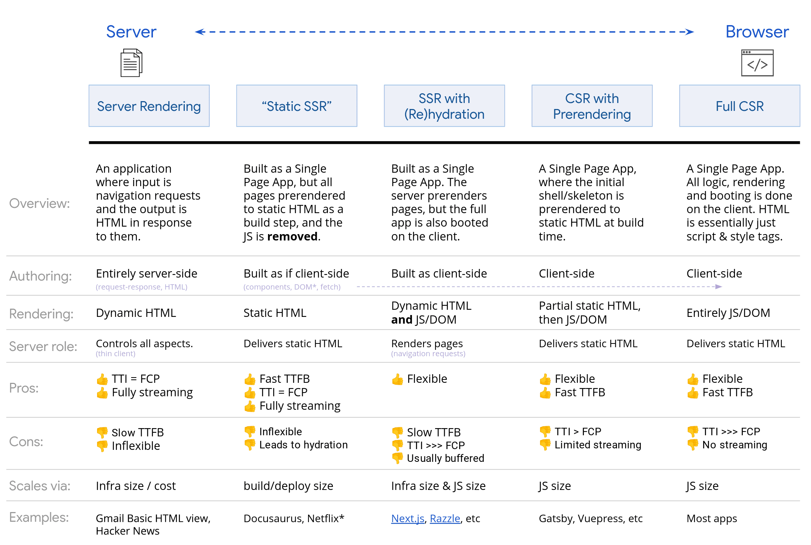

搜索引擎优化 (SEO) 旨在帮助搜索引擎了解您的内容，并通过搜索引擎帮助用户找到您的网站并决定是否应访问您的网站。对于不同的搜索引擎可能存在不同的优化策略，但是大同小异，我们以google搜索为例阐述

#### 工作原理

Google 搜索的原理分为 3 个阶段。其中执行抓取任务的程序称为 Googlebot，又称为蜘蛛程序

1. 抓取

    首先会找出网络上存在哪些网页，Googlebot 会不断搜索新网页和更新过的网页，并将其加入到队列中。如果出现网络错误无法访问网站，或者robots.txt设置了禁止抓取的规则，则不会被抓取。当我们以站点地图（sitemap）的方式提供网页让Google抓取时，或者 HTML 链接的 href 属性中存在其他网址，也会被发现并抓取

    > Googlebot 使用算法流程确定要抓取的网站、抓取频率以及要从每个网站抓取的网页数量。Googlebot不会过快的抓取网站，避免网站收到过多的请求，如网站500的时候会降低抓取速度

2. 编入索引

    抓取到网页后，Googlebot 会将所有网页都加入渲染队列，资源允许时无头 Chromium 便会渲染相应网页，了解该网页的内容，包括处理和分析文字内容以及关键内容标记和属性，如图片、标题等。网页在此队列中的存在时长可能会是几秒钟，但也可能会是更长时间。如果网页内容质量低，或者meta规则禁止编入索引，则不会被编入索引。另外相似的网页会被归为一组然后选择最具代表性的一个编入索引

3. 呈现结果

    用户输入查询时，机器会在索引中搜索匹配的网页，并返回我们认为与用户的搜索内容最相关的优质结果，其相关性包括位置、语言、设备等。已编入索引的情况下也可能不会被呈现，如网页内容与用户查询无关、网页内容质量低、meta规则禁止提供内容等

#### 排名和搜索结果呈现

为了有更好的排名和搜索结果呈现，以下是一些常见的优化手段

- title、description和keywords

```html
<title>标题</title>
<meta name="description" content="描述">
<meta name="keywords" content="关键词">
```

- HTML语义化会使搜索引擎更容易理解页面结构和主题，如标题标签（h1、h2、h3）、图片标签添加alt属性、段落标签p、列表标签（ul、li）、布局标签（header、nav、section、article、aside、footer）等

- 设置HTML标签的lang属性会使搜索引擎了解页面使用的语言

- 提高网页加载速度：客户端渲染 -> 服务端渲染，下面会详细展开

- sitemap站点地图：搜索引擎会根据 sitemap.xml 文件提供的信息来判断页面的更新频率、优先级等，进而决定何时重新爬取网站页面，一般会放在网站根目录下

```xml
<?xml version="1.0" encoding="UTF-8"?>
<urlset xmlns="http://www.sitemaps.org/schemas/sitemap/0.9">
   <url>
      <loc>https://www.example.com/</loc>
      <lastmod>2023-04-26T18:23:17+00:00</lastmod>
      <changefreq>daily</changefreq>
      <priority>1.0</priority>
   </url>
   <url>
      <loc>https://www.example.com/about</loc>
      <lastmod>2023-04-25T10:12:14+00:00</lastmod>
      <changefreq>monthly</changefreq>
      <priority>0.8</priority>
   </url>
</urlset>
```

- robots文件：指定抓取范围，一般会放在网站根目录下，也可以指定sitemap文件

```txt
User-agent: AdsBot-Google
Allow: /
Disallow: /*/abc

Sitemap: https://xxx.xml
```

- 内链和外链：通过内链让网站内部的页面形成网状结构，便于爬虫程序抓取；外链是指在别的网站引入自己网站的链接以提高流量，提升排名

- 重定向：当域名替换、改版导致的页面链接变化或直接被删除等情况下，需要重定向到合适的页面，避免流量损失

- 结构化数据会使搜索结果呈现出更丰富的内容，需要将一段JSON-LD格式的数据插入到script中，详见[结构化数据文档](https://developers.google.com/search/docs/appearance/structured-data/intro-structured-data?hl=zh-cn)

- 丰富网站内容：从长期来看丰富的网站内容可以吸引更多用户访问我们的网站，从而提升排名

#### 从客户端渲染到服务端渲染的渐进式方案选择



参考：
1. [Google搜索中心](https://developers.google.cn/search/docs?hl=zh-cn)
2. [从前端工程师的角度将SEO做到极致🌈](https://juejin.cn/post/7380688287549800467)
3. [Rendering on the Web](https://web.developers.google.cn/articles/rendering-on-the-web?hl=zh-cn)