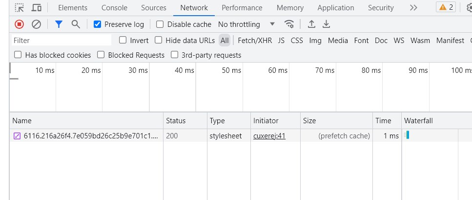
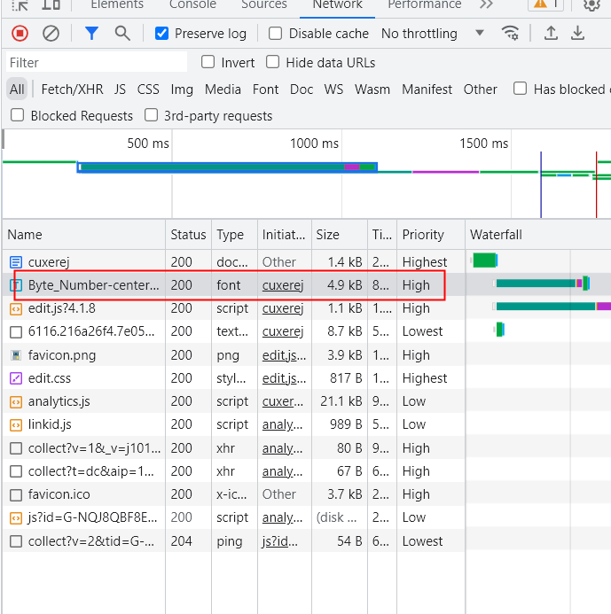
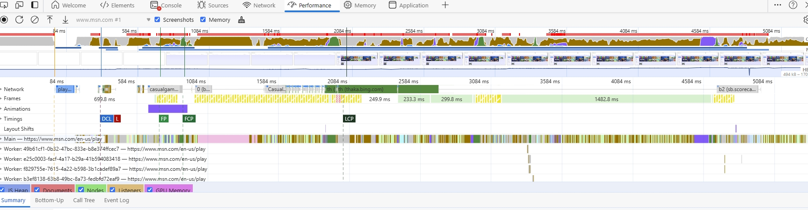

下面从几个角度来聊一下前端性能优化

#### 网络层面

从输入 url 到显示页面的过程中，涉及到网络相关的主要有 DNS 解析、TCP 连接、HTTP 请求/响应

##### 预连接（Preconnect）

用于提前与目标域名握手，完成 DNS 寻址，并建立 TCP 和 TLS 链接，从而减少后续访问目标域名时的连接耗时

```html
<link rel="preconnect" href="https://github.com" />
```

需要注意的是预连接生效后会与目标域名保持至少 10 秒钟的网络连接，建议只对重要的域名进行预连接，否则会占用资源，阻碍其他资源的加载

##### DNS 预取回（DNS-Prefetch）

用于对目标域名提前进行 DNS 解析，取回并缓存域名对应的 IP 地址，从而减少后续从目标域名加载资源的耗时

```html
<link rel="dns-prefetch" href="https://fonts.googleapis.com/" />
```

##### HTTP 请求

对于 DNS 解析和 TCP 连接，前端能做的优化非常有限，http 的请求和响应才是前端优化的重点，主要又分为以下两点

- 减少请求次数

  - 只请求当前需要的资源，例如异步的路由加载、图片懒加载、polyfill 动态加载等。用于 polyfill 的包一般比较大，可以通过以下的 cdn 去根据当前浏览器版本动态引入 polyfill
  - 单独的 chunk 不宜过小，小于 10kb 的 chunk 尽量合并，也不能过大，否则单次请求会很耗时

- 减少单次请求所花费的时间

  - 减小资源体积：构建工具一般内置了对 js、css 的压缩处理，基于 esm 的 tree-shaking 有效的减小了产出体积

  - 开启 gzip 压缩：gzip 是 http 压缩的一种方式，使用后 http 数据被服务端压缩然后发送给客户端，客户端在进行相应的解压，一般会减小响应 70%左右的大小，request header 中添加 accept-encoding:gzip 就可以开启。Gzip 压缩是服务器的工作，开启 gzip 压缩后会启动自己的 cpu 去完成这个任务，会损耗服务器的性能。Webpack 中 Gzip 压缩操作的存在，事实上就是为了在构建过程中去做一部分服务器的工作，为服务器分压

  - 图片：兼顾体积，选取合适的图片格式和分辨率

  - 尽量控制 cookie 大小：每次请求会携带同域名下的所有 cookie

  - cdn：内容分发网络指的是一组分布在各个地区的服务器，cdn 预热是指将原站的内容分发到各个地区的 cdn 节点上，cdn 刷新指当原站内容更新时强制去拉取最新的内容。如果没有进行 cdn 预热，大流量的请求会直接到原站服务器上，可能会导致崩溃。cdn 域名和业务域名是不同的，是为了防止请求 cdn 资源时携带与业务域名同源的 cookie

#### 浏览器层面

##### 浏览器缓存

缓存可以减少网络 IO 消耗，提高访问速度，主要包括内存缓存和 http 缓存，http 缓存主要分为强缓存和协商缓存，强缓存优先级更高

##### 预渲染

- 服务端渲染(SSR)：服务端生成好完整的 HTML 内容，直接返回给浏览器，浏览器能够根据 HTML 渲染出完整的首屏内容，而不需要依赖 JS 的加载，从而降低浏览器的渲染压力，节省浏览器请求数据的时间，有利于 seo 优化

- 静态站点生成(SSG)：在构建阶段生成完整的 HTML 内容，然后给浏览器完整的 HTML 内容，不需要依赖 JS 的加载。相比 SSR，SSG 的内容往往动态性不够，适合比较静态的站点，比如文档、博客等场景

##### 预取回（Prefetch）

用于提示浏览器在 CPU 和网络带宽空闲时，预先下载指定 URL 的 js、图片等各类资源，响应保存到本地的 prefetch cache 中，同时不会解析、运行该资源，从而减少该资源文件后续加载的耗时，相比于 Preload 兼容性较差

```html
<link rel="prefetch" href="https://B.com/index.js" as="script" />
```

命中预取回缓存的请求时，可以在浏览器开发者工具中看到 prefetch cache 标记



##### 预加载（Preload）

用于提高当前页面资源加载的优先级，确保关键资源优先加载完成，如字体文件，减少字体包加载缓慢造成字体闪烁

```html
<link rel="preload" as="font" href="/main.woff" />
<link rel="preload" href="style.css" as="style" />
<link rel="preload" href="main.js" as="script" />
<!--对于原生 ESM 模块，浏览器提供了 modulepreload 来进行预加载 -->
<link rel="modulepreload" href="/src/app.js" />
```

可以看到应用了 preload 的资源通常会以较高的优先级率先在网页中加载



#### 常见指标

点击浏览器开发者工具performance可以看到某段时间内页面的加载情况

- DCL（DOMContentLoaded）：DOM解析完毕
- L（Onload Event）：整个页面及所有依赖资源如样式表和图片都已完成加载时触发
- FP（First Paint）：渲染出第一个像素点，一般在HTML解析完成或者解析一部分时候触发，对于当前可见视口外的内容不会触发FP
- FCP（First Contentful Paint）：渲染出第一个内容，包括文本、图片、canvas等。如果html本身有内容，FCP和FP会一起触发，否则如果依赖js脚本展示内容的话，FCP会滞后
- LCP（largest contentful Paint）：最大内容渲染时间，用于度量视口中最大的内容元素何时可见，建议保持在2.5s内
- TTI（Time To Interactive）：达到页面可交互的时间，即页面已显示内容，可见元素的事件注册完成，主线程无long task（阻塞主线程达 50 毫秒或以上的任务）



对于一些需要自定义的时间节点，可以用Performance.mark在performance缓冲区添加一个时间戳，可以在开发者工具Performance-event hub中查看

参考

1. [2 行代码让 JS 加载耗时减少 67% | 文末福利](https://mp.weixin.qq.com/s/C2m2gBZUkYBWgD6OJ76FFA)
