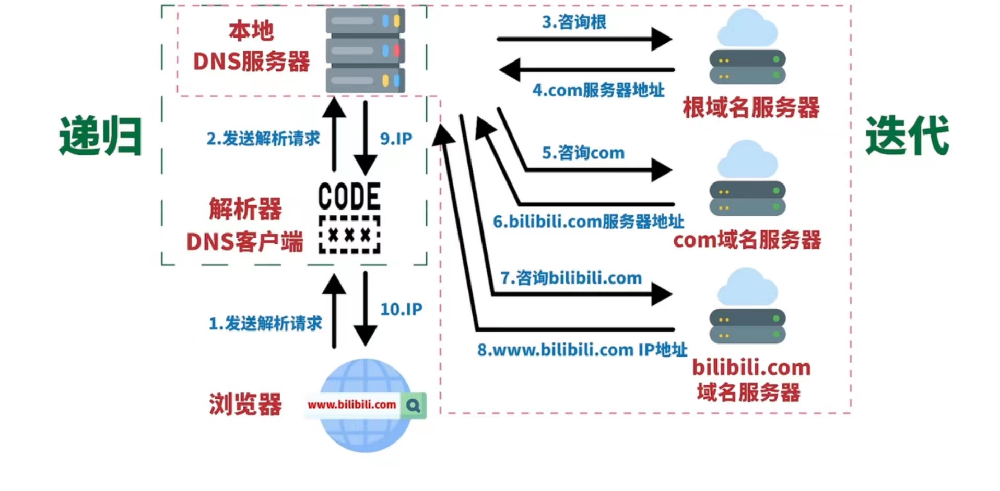

互联网的每一台主机都是用 ip 地址来标识位置的，ip 地址是数字或数字字母的组合，难以记忆。域名和 ip 是相关联的，方便记忆，但是计算机只识别 ip，这就需要域名转换为 ip。DNS 协议提供的是一种域名到 IP 地址的转换服务，是应用层协议，基于 UDP 协议之上，端口 43

#### 域名结构树

www.bilibili.com这个域名可以拆解如下，其中第一层的点代表根域名服务器，管理一群如com、cn等这样的顶级域名服务器，它们各自又管理一群如bilibili、baidu等这样的权限域名服务器，或者称为权威域名服务器。权威域名服务器管理各自的主机，如www、mail

#### 查询过程

1. 浏览器输入一个域名www.bilibili.com后，首先查找浏览器缓存中有没有对应的 ip 记录

2. 如果没有，查找主机本地文件 host 里有没有记录

3. 如果没有，向本地 DNS 服务器发出请求。本地 DNS 服务器一般由互联网服务提供商（ISP）管理，如中国电信。本地 DNS 服务器会查询自己的缓存，如果有就返回 ip 地址并标记为非权威，非权威表示是缓存的结果，而不是控管的相应服务器返回的结果

4. 如果没有，则向根服务器查询 com 顶级域名服务器地址，获取到之后向顶级域名服务器查询 bilibili.com 权威域名服务器地址，获取到之后向权威域名服务器查询www.bilibili.com域名服务器地址，也就是最终的ip地址，然后返回给本地域名服务器并缓存起来，最后本地域名服务器再返回给客户端

其中客户端与本地 DNS 服务器的查询过程是递归的，查询请求发出后自动向下一级查询，用户只需发出一次请求；而本地 DNS 服务器与其他域名服务器的查询过程是迭代的，查询请求后，域名服务器返回单次查询的结果。下一级的查询由用户自己请求，需要发出多次的查询请求

#### DNS 实现负载均衡

大型网站使用多台服务器提供服务，因此一个域名可能会对应多个服务器地址，相应的 DNS 会返回这个域名所对应的服务器 IP 地址的集合，然后将用户请求均衡的分配到各个不同的服务器上
