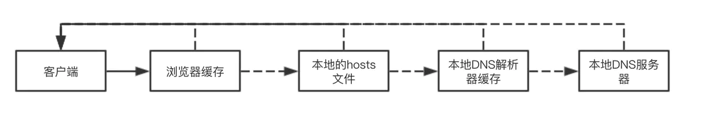
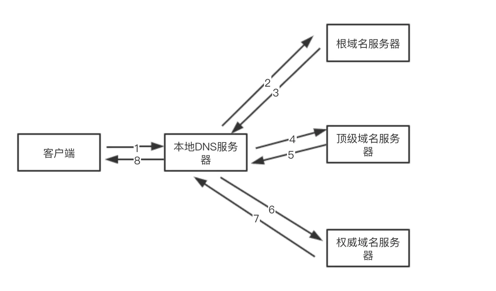

DNS 协议提供的是一种主机名到 IP 地址的转换服务，是应用层协议，基于 UDP 协议之上，端口 43

#### 查询过程

客户端在本地 DNS 服务器内查询的过程如下，这个过程是递归的。递归查询指的是查询请求发出后，自动向下一级查询，用户只需发出一次请求

本地 DNS 服务器向其他服务器查询的过程如下，如果没有依次向根域名服务器、顶级域名服务器、权威域名服务器查询，这个过程是迭代的。迭代查询指的是查询请求后，域名服务器返回单次查询的结果。下一级的查询由用户自己请求，用户需要发出多次的查询请求

#### DNS 缓存

在一个请求中，当某个 DNS 服务器收到一个 DNS 回答后，它能够回答中的信息缓存在本地存储器中

#### DNS 实现负载均衡

大型网站使用多台服务器提供服务，因此一个域名可能会对应多个服务器地址，相应的 DNS 会返回这个域名所对应的服务器 IP 地址的集合，然后将用户请求均衡的分配到各个不同的服务器上
