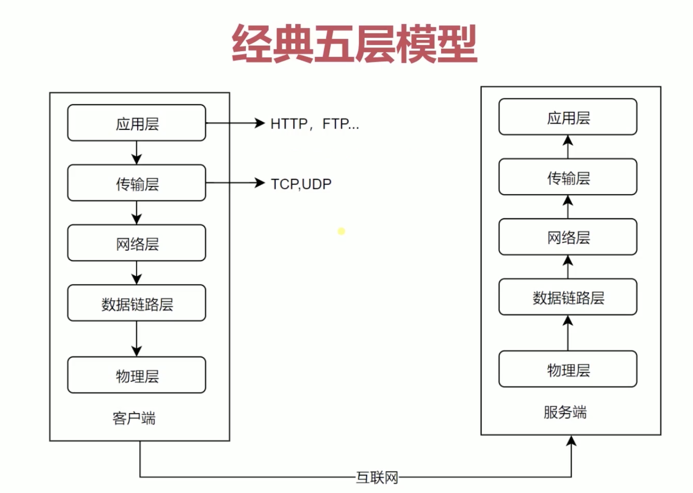

http 协议是建立在应用层上的协议，http 请求是建立在 TCP 连接之上的，TCP 建立连接时要经历三次握手才能发送 http 请求

#### 5 层网络模型

服务端和客户端都存在五层网络模型

- 物理层：定义物理设备如何传输数据，就是电脑的硬件，如网卡端口

- 数据链路层：负责封装和解封装 IP 报文，发送和接受 ARP/RARP 报文等

- 网络层：负责路由以及把分组报文发送给目标网络或主机

- 传输层：负责对报文进行分组和重组，并以 TCP 或 UDP 协议格式封装报文。在我的电脑和服务器建立连接后，用来定义数据传输的方式

- 应用层：负责向用户提供应用程序，比如 HTTP、FTP、Telnet、DNS、SMTP 等

#### http 报文

请求报文格式

- 起始行，即图中的 GET /test/hi-there.txt HTTP/1.0，包括请求方式、资源的 url、http 协议版本
- 请求头
- 请求体，与请求头以一个空行间隔

响应报文格式

- 起始行，即图中的 HTTP/1.0 200 OK，包括 http 协议版本、状态码、状态码具体含义
- 响应头
- 响应体，与响应头以一个空行间隔

#### http 请求方法

http1.1 规定了以下请求方法

- GET: 通常用来获取资源
- HEAD: 获取资源的元信息
- POST: 提交数据
- PUT: 修改数据
- DELETE: 删除资源
- CONNECT: 建立连接隧道，用于代理服务器
- OPTIONS: 列出可对资源实行的请求方法，用来跨域请求
- TRACE: 追踪请求-响应的传输路径

GET 和 POST 请求方法区别如下

- 参数：GET 一般放在 URL 中，因此不安全，POST 放在请求体中，更适合传输敏感信息
- 幂等性：幂等指表示执行相同的操作，结果也是相同的。GET 是幂等的，而 POST 不是
- 缓存：GET 请求会被浏览器主动缓存下来，而 POST 默认不会
- TCP：GET 请求会把请求报文一次性发出去，而 POST 会分为两个 TCP 数据包，首先发 header 部分，如果服务器响应 100(continue)， 然后发 body 部分

#### http 特点

灵活可扩展，可以传输各种数据；可靠传输，HTTP 基于 TCP/IP 协议；http 是无状态的，每次 http 请求都是独立、无关的，默认不需要保留状态信息，可以减少网络开销

但也存在一些缺点。在一些需要长连接的场景中，需要保存一些上下文数据避免数据重复传输，这时候无状态反而不好了；报文明文传输，容易被攻击

#### http 版本

##### http0.9

- 只有一个请求方式 get，没有 header 等描述数据信息
- 服务器发送完毕后，就关闭 TCP 连接

##### http1.0

- 增加了 post 等请求方式，增加了 status code 和 header，status code 用来描述服务端处理请求后的状态，header 用来描述请求和响应的数据信息

##### http1.1

- 持久连接，在 http1.0 中，每发送一个 http 请求，就要在客户端和服务端之间创建一个 TCP 连接，服务端响应后就会关闭，创建这样的连接成本比较高，http1.1 中避免了这样的问题

- pipeline，一个 TCP 连接可以发送多个 http 请求，服务端接收到这些请求后顺序接收，但是存在的问题是，如果前一个请求耗时较长会影响后一个请求的接收，产生 HTTP 队头阻塞问题

- 增加 header 的一些描述信息，如 host

关于 HTTP 队头阻塞的问题，解决方式如下

- 提高并发连接数量，对于一个域名允许分配多个长连接，相当于有多个队列，如 Chrome 中允许的最大并发连接是 6 个
- 域名分片，如 sanyuan.com 分出 content1.sanyuan.com 、content2.sanyuan.com 这样的二级域名，这样允许的并发连接就更多了

##### http2

- 多路复用

在同一个 TCP 连接中上一次请求没有响应就会阻塞下一个请求，造成队头阻塞问题，HTTP1.1 中利用增加并发连接才解决，但没有从根本上解决问题，HTTP2 采用二进制分帧的方式解决了这个问题

HTTP2 将报文转成二进制进行传输，用 Headers 帧存放头部字段，Data 帧存放 body 体数据，服务器看到的不再是一个个完整的 HTTP 请求报文，而是一堆乱序的二进制帧。这些二进制帧不存在先后关系，因此也就不会排队等待。二进制帧到达后对方会将 Stream ID 相同的二进制帧组装成完整的请求报文和响应报文。

通信双方都可以给对方发送二进制帧，这种二进制帧的双向传输的序列，也叫做流。HTTP/2 用流来在一个 TCP 连接上来进行多个数据帧的通信，这就是多路复用的概念

- 头部压缩

在 HTTP/1.1 之前可以通过 Content-Encoding 来指定响应体的编码形式，HTTP/2 针对头部字段采用了相应的压缩算法 HPACK

    - 首先是在服务器和客户端之间建立哈希表，将用到的字段存放在这张表中，那么在传输的时候对于之前出现过的值，只需要把索引传给对方即可，对方拿到索引查表去查询
    - 对于整数和字符串进行哈夫曼编码，哈夫曼编码的原理就是先将所有出现的字符建立一张索引表，然后让出现次数多的字符对应的索引尽可能短，传输的时候也是传输这样的索引序列

- 推送，服务端也可以主动推送数据给客户度

在 HTTP/2 当中，服务器已经不再是完全被动地接收请求，响应请求，它也能新建 stream 来给客户端发送消息

##### http2 二进制帧传输过程

二进制帧分帧头和帧体，帧头存放头部字段，帧体存放 body 数据。帧类型分为用来存放 HTTP 报文的数据帧和用来管理流的传输的控制帧，帧标志常见的有 END_HEADERS（头数据结束）、END_STREAM（数据发送结束），流标识符就是 Stream ID，用来将乱序的二进制帧拼接成完整的报文

传输过程如下，类似 TCP 挥手过程

1. 空闲状态时，客户端发送帧头并分配 Stream ID，然后两端的流都打开，开始相互传递数据帧和控制帧
2. 当客户端要关闭时，向服务端发送 END_STREAM 帧，进入半关闭状态, 这个时候客户端只能接收数据，而不能发送数据
3. 服务端收到这个 END_STREAM 帧后也进入半关闭状态，这个时候客户端只能发送数据，而不能接收数据
4. 随后服务端也向客户端发送 END_STREAM 帧，表示数据发送完毕，双方进入关闭状态

> Stream ID 不能重用，如果下次要开启新的流，流 ID 需要自增

参考

1. [HTTP 灵魂之问](https://juejin.cn/post/6844904100035821575)
