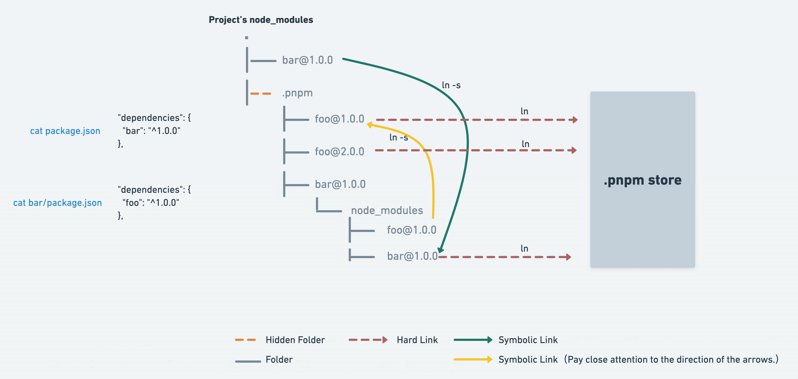

#### npm

##### npx

npm 从 5.2 版开始，增加了 npx 命令

1. 调用项目内部安装的模块。npx 的原理很简单，就是运行的时候，会到 node_modules/.bin 路径和环境变量$PATH 里面，检查命令是否存在，如安装了 webpack-cli 后可以直接运行

```
npx webpack
```

2. 避免全局安装模块。如下，npx 将 create-react-app 下载到一个临时目录，使用以后再删除。所以，以后再次执行上面的命令，会重新下载 create-react-app

```
npx create-react-app my-react-app
```

3. 使用不同版本的 node

```
npx node@0.12.8 -v
```

##### cnpm

npm 安装插件是从国外服务器下载，受网络影响大，可能出现异常，cnpm 是从淘宝镜像下载的，相对稳定

```
npm install -g cnpm --registry=https://registry.npm.taobao.org
```

#### yarn

yarn 和 npm 相比具有以下优势

- 运行快：运行速度得到了显著的提升，整个安装时间也变得更少

- 离线模式：如果之前已经安装过一个软件包，用 Yarn 再次安装时之间从缓存中获取，就不用像 npm 那样再从网络下载了

- 并行安装：无论 npm 还是 Yarn 在执行包的安装时，都会执行一系列任务。npm 是按照队列执行每个 package，也就是说必须要等到当前 package 安装完成之后，才能继续后面的安装。而 Yarn 是并行执行所有任务

- lock 文件，为了防止拉取到不同的版本，有一个锁定文件 (yarn.lock 或 package-lock.json) 记录了被确切安装上的模块的版本号，只是文件格式不同

- 更简洁的输出，yarn 在终端输出的信息更为简洁

#### pnpm

pnpm 相比于 npm 和 yarn，包安装速度极快，磁盘空间利用非常高效，且支持 monorepo

##### 三层寻址

npm i 或 yarn 之后到生成 node_modules 经历了以下几步：将依赖包的版本区间解析为具体的版本号，下载对应版本的 tar 包到本地，然后解压、拷贝到 node_modules 目录

在 npm2 版本以下依赖树呈现的是嵌套结构，容易导致文件路径过长，大量包被重复安装

```
node_modules
└─ foo
   ├─ index.js
   ├─ package.json
   └─ node_modules
      └─ bar
         ├─ index.js
         └─ package.json
```

于是 yarn 和 npm3 版本之后通过扁平化依赖解决了以上的问题，但扁平化算法本身的复杂性很高，耗时较长

```
node_modules
├─ foo
|  ├─ index.js
|  └─ package.json
└─ bar
   ├─ index.js
   └─ package.json
```

pnpm 是将全局 store 硬连接到 node_modules/.pnpm 中，其依赖树是嵌套结构，相互之间通过软连接组织。一个包全局只存了一份，其余地方都靠软硬连接，节省了磁盘空间；没有做扁平化，减少了耗时



pnpm 依赖文件经历了三层寻址，即每个包的寻找都要经过三层结构：node_modules/package-a > 软链接 node_modules/.pnpm/package-a@1.0.0/node_modules/package-a > 硬链接 ~/.pnpm-store/v3/files/00/xxxxxx

- 第一层：采用了 npm2 版本的包管理方式，依赖树呈嵌套结构，没有将依赖打平减少了耗时。还解决了幻影依赖的问题，幻影依赖是指某个包并没有直接被定义在 package.json 中而是作为子依赖存在，在高版本的 npm 或 yarn 中会平铺到 node_modules 目录下，而 pnpm 的某一层目录只包含当前 package.json 对应的包
- 第二层：利用软链接解决了代码重复引用的问题
- 第三层：利用硬链接指向一个统一的全局管理路径 pnpm-store，节省了磁盘空间

其中硬链接和软链接的原理如下

- 硬链接：通过硬链接创建的 N 个文件都是等效的，修改时文件内容同步变化
- 软链接：指向文件地址指针的指针

##### 全局安装目录 pnpm-store 的组织方式

全局的 pnpm-store 文件中存放的并不是包的源码而是一个哈希文件，相比基于文件名寻址，基于内容的寻址的好处是即便包版本升级了，也仅需存储改动 Diff，而不需要存储新版本的完整文件内容，在版本管理上进一步节约了存储空间

```
~/.pnpm-store
- v3
  - files
    - 00
      - e4e13870602ad2922bfc7..
      - e99f6ffa679b846dfcbb1..
      ..
    - 01
      ..
    - ..
      ..
    - ff
      ..
```

参考

1. [pnpm](https://github.com/ascoders/weekly/blob/master/%E5%89%8D%E6%B2%BF%E6%8A%80%E6%9C%AF/253.%E7%B2%BE%E8%AF%BB%E3%80%8Apnpm%E3%80%8B.md)
