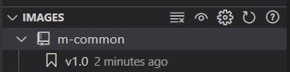
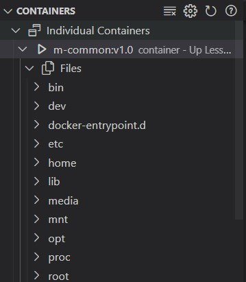

#### Dockerfile 定制镜像

DockerHub 等网站都提供了众多镜像，一般情况下我们都会从它那找个镜像作为基础镜像，然后再进行我们的后续操作

```dockerfile
# 引用基础镜像，即1.21.5版本的nginx、alpine操作系统，alpine是linux轻量型发行版
FROM nginx:1.21.5-alpine
# 将当前目录下的所有文件（除了.dockerignore排除的路径）拷贝到image 文件的目录下
COPY ./build /usr/share/nginx/html
COPY ./devops/default.conf /usr/share/nginx/conf.d/default.conf
# 容器工作目录
WORKDIR /app
# 之后的操作都在/app目录下进行，执行脚本
RUN npm install --registry=https://registry.npm.taobao.org
# 将容器 80 端口暴露出来，允许外部连接这个端口
EXPOSE 80
# 容器启动后自动执行的cmd命令
CMD ["nginx", "-g", "daemon off;"]
```

> 一个 Dockerfile 可以包含多个 RUN 命令，但是只能有一个 CMD 命令

如果想忽略某些文件，不想 COPY，可以用.dockerignore 文件声明

```
node_modules
Dockerfile
.dockerignore
```

#### 构建镜像

文件目录下执行以下脚本， docker 引擎会根据 Dockerfile 的配置构建镜像

```bash
docker build .
# 构建时可以指定镜像名称
docker build -t project:v1.0 .
```

构建完成后查看镜像

```bash
docker images
```



默认没有名称，只有镜像 id，手动添加名称

```bash
# 版本不加默认是lastest
docker tag [imageID] project:v1.0
```

#### 推送镜像

注册 docker hub 账号然后登陆，并推送到 docker hub，或者推送到自己的服务器上

```bash
docker login
docker push project:v1.0

# 删除镜像，如果有必要的话，-f表示强行删除
docker rmi -f project:v1.0
# 拉取镜像
docker pull project:v1.0
```

#### 运行镜像

生成一个容器实例用来运行镜像

```bash
# -d表示后台运行，不占用当前终端
docker run -d project:v1.0
# 查看正在运行的容器
docker ps
# 暂停容器运行
docker stop [containerID|containername]
# 删除容器
docker rm -f [containerID|containername]
# 进入/app工作目录下
docker exec -it container /bin/sh
# 查看 docker 容器的输出
docker container logs [containerID]
```



端口映射，通过-p 指定。如下，容器内的 80 端口可以在主机的 3000 端口进行访问

```bash
# --name用来指定容器名称，映射后可以用localhost:3000访问了
docker run -d -p 3000:80 --name container project:v1.0
```

数据卷挂载，通过-v 指定，即将主机的某个目录和容器的某个目录绑定，可以同步修改。如下，将主机的/Users/demo 挂载到容器的/app 目录

```bash
# :ro表示只读，防止容器的变更映射到本地文件中
# 第二个-v表示忽略掉node_modules文件的同步
docker run -d -v /Users/demo:/app:ro -v /Users/demo/node_modules -p 3000:80 --name container project:v1.0
```

#### 优化技巧

##### 使用 alpine 镜像

docker 容器内跑的是 linux 系统，各种镜像的 dockerfile 都会继承 linux 镜像作为基础镜像。但默认的 linux 镜像体积比较大，alpine 是 linux 轻量型发行版，去掉了很多 linux 里用不到的功能，减小了镜像体积

##### 使用多阶段构建

docker 是分层存储的，dockerfile 里的每一行指令是一层，会做缓存。每次 docker build 的时候，只会从变化的层开始重新构建，没变的层会直接复用

示例如下，一次性将所有文件全部复制，产生的问题是其他文件发生变化也会重新执行 npm install，无法复用

```dockerfile
FROM node:18-alpine3.14
WORKDIR /app
COPY . .
RUN npm i
RUN npm run build
EXPOSE 3000
CMD ['node', './dist/index.js']
```

改进如下，先把 package.json 复制进去，这样只有 package.json 变了才会重新执行 npm install

```dockerfile
FROM node:18-alpine3.14
WORKDIR /app
COPY package.json .
RUN npm i
COPY . .
RUN npm run build
EXPOSE 3000
CMD ['node', './dist/index.js']
```

还可以优化下镜像体积，我们只需要 build 后的文件复制进去，采用多阶段构建。docker build 之后，只会留下最后一个阶段的镜像

```dockerfile
# as指定当前构建阶段的名字
FROM node:18-alpine3.14 as build-stage
WORKDIR /app
COPY package.json .
RUN npm i
COPY . .
RUN npm run build

FROM node:18-alpine3.14 as production-stage
# 从上个阶段复制文件过来
COPY --from=build-stage /app/dist /app
COPY --from=build-stage /app/package.json /app/package.json
WORKDIR /app
RUN npm i
EXPOSE 3000
CMD ['node', './dist/index.js']
```

##### 环境变量

ARG 声明构建参数，使用 ${xxx} 来取；ENV 声明环境变量。示例如下

```js
console.log(process.env.aaa);
```

```dockerfile
FROM node:18-alpine3.14
ARG aaa
ENV aaa=${aaa}
CMD ["node", "/app/test.js"]
```

执行以下命令，最终控制台输出 123

```bash
docker run --build-arg aaa=123
```

##### ENTRYPOINT 和 CMD

##### COPY 和 ADD

参考

1. [5 个技巧，让你的 dockerfile 像个大师](https://mp.weixin.qq.com/s/QFLE8gPHWmCYEO3xX0K7IQ)
