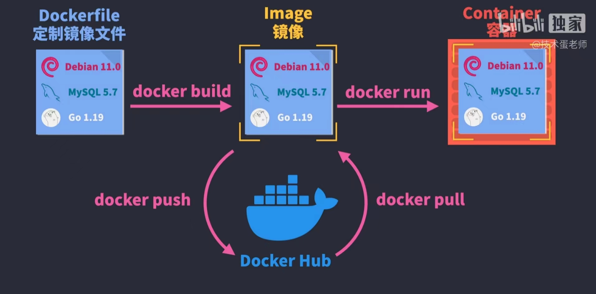

docker 核心工作流如下



#### Dockerfile 定制镜像

DockerHub 等网站都提供了众多镜像，一般情况下我们都会从它那找个镜像作为基础镜像，然后再进行我们的后续操作

```bash
# 引用基础镜像，即1.21.5版本的nginx、alpine操作系统，alpine是linux轻量型发行版
FROM nginx:1.21.5-alpine
# 将当前目录下的所有文件（除了.dockerignore排除的路径）拷贝到image 文件的目录下
COPY ./build /usr/share/nginx/html
COPY ./devops/default.conf /usr/share/nginx/conf.d/default.conf
# 容器工作目录
WORKDIR /app
# 之后的操作都在/app目录下进行，执行脚本
RUN npm install --registry=https://registry.npm.taobao.org
# 将容器 80 端口暴露出来，允许外部连接这个端口
EXPOSE 80
# 容器启动后自动执行的cmd命令
CMD ["nginx", "-g", "daemon off;"]
```

> 一个 Dockerfile 可以包含多个 RUN 命令，但是只能有一个 CMD 命令

如果想忽略某些文件，不想 COPY，可以用.dockerignore 文件声明

```
node_modules
Dockerfile
.dockerignore
```

#### 构建镜像

文件目录下执行以下脚本， docker 引擎会根据 Dockerfile 的配置构建镜像

```bash
docker build .
# 构建时可以指定镜像名称
docker build -t project:v1.0 .
```

构建完成后查看镜像

```
docker images
```

默认没有名称，只有镜像 id，手动添加名称

```
docker tag [imageID] project:v1.0，版本不加默认是lastest
```

#### 注册 docker hub 账号然后登陆，并推送到 docker hub

```bash
docker login
docker push project:v1.0

# 删除镜像，如果有必要的话，-f表示强行删除
docker rmi -f project:v1.0
# 拉取镜像
docker pull project:v1.0
```

#### 运行镜像

```bash
# -d表示后台运行，不占用当前终端
docker run -d project:v1.0
# 查看正在运行的容器
docker ps
```

也可以映射主机端口，使得本地可以访问服务

```bash
# --name用来指定容器名称，映射后可以用localhost:3000访问了
docker run -d -p 3000:80 --name container project:v1.0

# 暂停容器运行
docker stop [containerID|containername]
# 删除容器
docker rm -f [containerID|containername]
```

还可以设置 volume 将本地文件夹和容器文件夹绑定，这样本地文件的变更就会同步到容器中

```bash
# :ro表示只读，防止容器的变更映射到本地文件中
# 第二个-v表示忽略掉node_modules文件的同步
docker run -d -v /Users/demo:/app:ro -v /Users/demo/node_modules -p 3000:80 --name container project:v1.0
```

其他

```bash
# 进入/app工作目录下
docker exec -it container /bin/sh
# 查看 docker 容器的输出
docker container logs [containerID]
```
