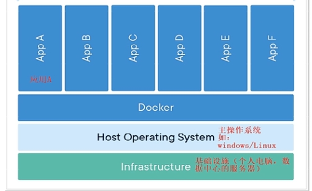

#### 引入

软件开发最大的麻烦事之一，就是环境配置，实际工作中开发环境、测试环境、生产环境或多或少都有所差别。要想从根本上解决问题，安装的时候需要把原始环境一模一样地复制过来

虚拟机就是带环境安装的一种解决方案，它可以在一种操作系统里面运行另一种操作系统，应用程序对此毫无感知，因为虚拟机看上去跟真实系统一模一样，而对于底层系统来说，虚拟机就是一个普通文件，不需要了就删掉，对其他部分毫无影响，但是存在几个问题

- 资源占用多，虚拟机会独占一部分内存和硬盘空间
- 冗余步骤多，虚拟机是完整的操作系统
- 启动慢

于是发展出了另一种虚拟化技术：Linux 容器，它不是模拟一个完整的操作系统，而是对进程进行隔离，有了容器就可以将软件运行所需的资源打包到容器里，不需要捆绑一整套操作系统。Linux 容器相比于虚拟机有以下优势

- 启动快，容器里面的应用，直接就是底层系统的一个进程，而不是虚拟机内部的进程
- 资源占用少，容器只占用需要的资源
- 体积小，容器只要包含用到的组件即可，而虚拟机是整个操作系统的打包

而 Docker 就是属于 Linux 容器的一种封装，在操作系统层面上实现虚拟化，直接复用操作系统

> Docker 实质上是在已经运行的 Linux 下制造了一个隔离的文件环境，所以必须部署在 Linux 内核的系统上，其他系统想部署 Docker 就必须安装一个虚拟 Linux 环境

#### 概念

Docker 是基于 go 语言的云开源项目，可以使用户的应用和运行环境做到“一次镜像，处处运行”。它提供简单易用的容器使用接口，将应用程序与该程序相关的依赖打包在一个文件里面。运行这个文件，就会生成一个虚拟容器，程序在这个虚拟容器里运行，就好像在真实的物理机上运行一样，它主要有以下优势

- 提供一次性的环境，如本地测试他人的软件、持续集成的时候提供单元测试和构建的环境
- 提供弹性的云服务，可以随开随关，很适合动态扩容和缩容
- 组建微服务架构，一台机器可以跑多个服务

#### 三要素

Docker 中有三个核心概念

- Image：镜像是一种文件存储形式，一个磁盘上的数据在另一个磁盘上存在一个完全相同的副本即为镜像，只读。Docker 把应用程序及其依赖打包在镜像文件里面，同一个镜像文件可以生成多个同时运行的容器实例
- Container：用镜像文件创建的容器实例，本身也是一个文件，称为容器文件。容器是镜像运行的载体，可以把容器看作一个简易的 linux 环境。Docker 给容器创建了独立的端口、进程、文件等“空间”，容器就是一个与宿机隔离 “容器”，容器可宿主机之间可以进行 port、volumes、network 等的通信
- Repository：集中存放镜像的地方，常用的 Docker hub 有 https://hub.docker.com/ （最大的公开仓库）、 https://cr.console.aliyun.com/ 等。国外的镜像仓库比较慢，一般会借助阿里云容器镜像服务中的镜像加速器

Docker 核心工作流如下

#### 运行流程

Docker 是一个 Client-Server 结构的系统，Docker 守护进程运行在主机上，通过 Socket 连接从客户端访问，守护进程从客户端接收命令并管理运行在主机上的容器，其基本运行流程如下

1. Docker Client（命令行窗口）与 Docker Daemon（守护进程）建立通信，并发送请求
2. Docker Daemon 提供 Docker Server 处理客户端的请求
3. Docker Daemon 提供 Docker Engine（引擎）处理工作，每一项工作以 Job 形式存在，管理每个运行的容器。Job 运行的过程中，当需要容器镜像时会从仓库下载镜像，并以 Graph 的形式存储
4. 当需要创建网络环境时（如容器之间需要通信），会通过驱动 Network Driver 创建并配置 Docker 容器网络环境
5. 当需要限制容器运行资源或执行命令用户等操作时，通过 Exec Driver 完成
