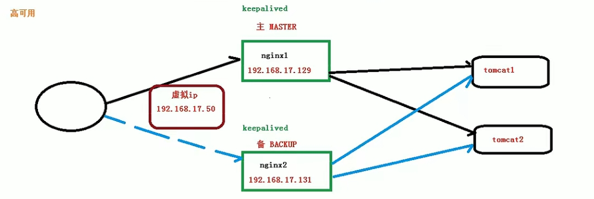

#### 安装

以 linux 系统为例

1. 从官网下载 nginx，先安装 pcre、zlib 等相关依赖

2. 安装 nginx，将压缩文件下载到 linux 中并解压，进入目录执行./configure，执行 make && make install

3. 安装成功后，/usr/local/nginx/sbin 路径下执行./nginx 启动 nginx，执行下面脚本查看 nginx 进程，常用的配置文件就在/usr/local/nginx/conf/nginx.conf 下

```bash
ps -ef | grep nginx
```

4. linux 默认开启防火墙，需要开放端口才能访问

```bash
# 查看
firewall-cmd --list-all
# 开放端口
sudo firewall-cmd --add-port=80/tcp --permanent
# 重启防火墙
firewall-cmd --reload
```

#### 常用命令

执行 nginx 命令的前提是要进到/usr/local/nginx/sbin 下

```bash
# 查看版本号
./nginx -v
# 启动nginx
./nginx
# 关闭nginx
./nginx -s stop
# 重新加载nginx，热重启
./nginx -s reload
```

#### 配置文件

nginx.conf 位于/usr/local/nginx/conf/nginx.conf 下，结构如下

```
main        # 全局配置，对全局生效
├── events  # 配置影响 Nginx 服务器或与用户的网络连接
├── http    # 配置代理，缓存，日志定义等绝大多数功能和第三方模块的配置
│   ├── upstream # 配置后端服务器具体地址，负载均衡配置不可或缺的部分
│   ├── server   # 配置虚拟主机的相关参数，一个 http 块中可以有多个 server 块
│   ├── server
│   │   ├── location  # server 块可以包含多个 location 块，location 指令用于匹配 uri
│   │   ├── location
│   │   └── ...
│   └── ...
└── ...
```

主要包含三个部分

- 全局块：从配置文件开始到 events 块之间的内容，主要设置一些影响 nginx 整体服务的配置指令，如运行 nginx 服务的用户、允许生成的 worker process 数、日志存放路径、配置文件引入等
- events 块：这部分的指令主要影响 nginx 服务器和用户的网络连接，如是否允许同时接收多个网络、每个进程允许最大并发数、选取哪种事件驱动模型来处理连接请求等
- http 块：包括代理、缓存、日志定义、第三方配置等
  - http 全局块：从 http 块开始到 server 块之间的内容，包括文件引入、日志定义、mime-type 定义、连接超时时间、单链接请求上限等
  - server 块：每个 http 块可以有多个 server 块，每个 server 块就相当于一个虚拟主机
    - server 全局块：从 server 块开始到 location 块之间的内容，包括当前虚拟主机监听端口、域名等
    - location 块：每个 server 块可以有多个 location 块，对特定请求进行处理

配置如下

```conf
########## 全局块 ##########
user  nginx;                        # 运行用户，默认即是nginx，可以不进行设置
worker_processes  1;                # Nginx 进程数，并发处理的关键配置，一般设置为和 CPU 核数一样
error_log  /var/log/nginx/error.log warn;   # Nginx 的错误日志存放目录
pid        /var/run/nginx.pid;      # Nginx 服务启动时的 pid 存放位置

########## events块 ##########
events {
    use epoll;     # 使用epoll的I/O模型(如果你不知道Nginx该使用哪种轮询方法，会自动选择一个最适合你操作系统的)
    worker_connections 1024;   # 每个进程允许最大并发数
}

########## http块 ##########
http {
    ########## http 全局块 ##########
    # 设置日志模式
    log_format  main  '$remote_addr - $remote_user [$time_local] "$request" '
                      '$status $body_bytes_sent "$http_referer" '
                      '"$http_user_agent" "$http_x_forwarded_for"';

    access_log  /var/log/nginx/access.log  main;   # Nginx访问日志存放位置

    sendfile            on;   # 开启高效传输模式
    tcp_nopush          on;   # 减少网络报文段的数量
    tcp_nodelay         on;
    keepalive_timeout   65;   # 保持连接的时间，也叫超时时间，单位秒
    types_hash_max_size 2048;

    include             /etc/nginx/mime.types;      # 文件扩展名与类型映射表
    default_type        application/octet-stream;   # 默认文件类型

    include /etc/nginx/conf.d/*.conf;   # 加载子配置项

    ########## server块 ##########
    server {
      ########## server全局块 ##########
    	listen       80;       # 配置监听的端口
    	server_name  localhost;    # 配置的域名

      ########## location块 ##########
    	location / {
    		root   /usr/share/nginx/html;  # 网站根目录
    		index  index.html index.htm;   # 默认首页文件
    		deny 172.168.22.11;   # 禁止访问的ip地址，可以为all
    		allow 172.168.33.44； # 允许访问的ip地址，可以为all
    	}

    	error_page 500 502 503 504 /50x.html;  # 默认50x对应的访问页面
    	error_page 400 404 error.html;   # 同上
    }
}
```

配置文件的语法规则如下

- 配置文件由指令与指令块构成，每条指令以 ; 分号结尾，指令与参数间以空格符号分隔；指令块以 {} 大括号将多条指令组织在一起
- include 语句允许组合多个配置文件以提升可维护性
- 使用 # 符号添加注释；使用 $ 符号使用变量，nginx 预置了一些全局变量

#### 常见用途

- 单页面项目 history 路由配置

```conf
server {
  listen       80;
  server_name  fe.sherlocked93.club;

  location / {
    root       /usr/share/nginx/html/dist;  # vue 打包后的文件夹
    index      index.html index.htm;
    try_files  $uri $uri/ /index.html @rewrites;

    expires -1;                          # 首页一般没有强制缓存
    add_header Cache-Control no-cache;
  }

  location @rewrites {
    rewrite ^(.+)$ /index.html break;
  }
}
```

- 反向代理

```conf
# location语法如下
# = 精确匹配
# ^~ 用于不含正则表达式的 uri
# ~ 表示用该符号后面的正则去匹配路径，区分大小写
# ~* 表示用该符号后面的正则去匹配路径，不区分大小写
location [ = | ~ | ~* | ^~] uri {
	...
}
# 示例
location ~ /api/ {
    # 重写请求url，将正则匹配中的第一个()中$1的path，拼接到真正的请求后面，并用break停止后续匹配
    rewrite ^/apis/(.*)$ /$1 break;
    # 代理
    proxy_pass https://www.kaola.com/;
}
```

- 适配 PC 与移动环境

很多网站都存在 PC 站和 H5 站两个站点,根据用户的浏览环境自动切换站点

```conf
location / {
    # 移动、pc设备适配
    if ($http_user_agent ~* '(Android|webOS|iPhone|iPod|BlackBerry)') {
        set $mobile_request '1';
    }
    if ($mobile_request = '1') {
        rewrite ^.+ http://mysite-base-H5.com;
    }
}
```

- 配置 https

```conf
server {
  listen 443 ssl http2 default_server;   # SSL 访问端口号为 443
  server_name sherlocked93.club;         # 填写绑定证书的域名

  ssl_certificate /etc/nginx/https/1_sherlocked93.club_bundle.crt;   # 证书文件地址
  ssl_certificate_key /etc/nginx/https/2_sherlocked93.club.key;      # 私钥文件地址
  ssl_session_timeout 10m;

  ssl_protocols TLSv1 TLSv1.1 TLSv1.2;      #请按照以下协议配置
  ssl_ciphers ECDHE-RSA-AES128-GCM-SHA256:HIGH:!aNULL:!MD5:!RC4:!DHE;
  ssl_prefer_server_ciphers on;

  location / {
    root         /usr/share/nginx/html;
    index        index.html index.htm;
  }
}
```

- 配置 websocket

```conf
location /ws/ {
    proxy_pass http://192.168.1.101:6688/;
    proxy_http_version 1.1;
    proxy_set_header Upgrade $http_upgrade;
    proxy_set_header Connection "Upgrade";
}
```

- 实现简单的访问限制

```conf
location / {
    # 首先禁止192.168.1.100访问
    deny  192.168.1.100;
    # 允许192.168.1.10-200 ip段内除192.168.1.100的访问
    allow 192.168.1.10/200;
    # 允许10.110.50.16访问
    allow 10.110.50.16;
    # 剩下未匹配到的全部禁止访问
    deny  all;
}
```

- 负载均衡

nginx 提供了几种负载均衡的方式

    - 轮询：默认方式，每个请求按时间顺序逐一分配到不同的后端服务器
    - weight：权重分配，指定轮询几率，权重越高，在被访问的概率越大
    - ip_hash：每个请求按访问 IP 的 hash 结果分配，这样每个访客固定访问一个后端服务器
    - fair：按后端服务器的响应时间分配，响应时间短的优先分配

```conf
http {
  # 负载均衡到三台服务器上
  upstream myserver {
  	# ip_hash;  # ip_hash 方式
    # fair;   # fair 方式
    server 127.0.0.1:8081;  # 负载均衡目的服务地址
    server 127.0.0.1:8080;
    server 127.0.0.1:8082 weight=10;  # weight 方式，不写默认为 1
  }

  server {
    location / {
      # myserver就是负载均衡upstream后面的服务名
      proxy_pass http://myserver;
      proxy_connect_timeout 10;
    }
  }
}
```

- 动静分离

把动态和静态的请求分开，可以动态跟静态文件混合在一起发布，通过 Nginx 配置来分开。一般会把静态资源放到单独的服务器上

```conf
server {
  # 访问的是/data/www下的资源
  location /www/ {
  	root /data/;
    index index.html index.htm;
  }

  # 访问的是/data/image下的资源
  location /image/ {
  	root /data/;
    # 会将当前文件夹的内容列出来
    autoindex on;
  }
}
```

- 高可用

高可用用来保证 nginx 服务的稳定性，需要两台 nginx，分别充当主服务和备用服务，两台服务器对应两个不同的 ip。借助 keepalived 对外暴露一个虚拟 ip，初始和主 nginx 服务器绑定，监听服务器状态，如果主服务器宕机，就切换到备用服务器（虚拟 ip 绑定到备用服务器）



#### 原理

##### master 进程和 worker 进程

启动 Nginx 后，其实就是在 80 端口启动了 Socket 服务进行监听，并开启 Master 进程和 Worker 进程，当客户端向 nginx 服务器发送一个请求后，master 进程下的 worker 进程会争抢这个任务然后进行处理

- Master 进程用来读取并验证配置文件 nginx.conf，管理多个 worker 进程
- 每一个 Worker 进程都维护一个线程，用来处理连接和请求

一个 master 进程下有多个 worker 进程的优势如下

- 热部署：配置文件 nginx.conf 修改后 nginx -s reload 就可以让配置文件生效，实现热部署。修改配置文件 nginx.conf 后，重新生成新的 worker 进程，当然会以新的配置进行处理请求，而且新的请求必须都交给新的 worker 进程。至于老的 worker 进程，等把那些以前的请求处理完毕后，kill 掉即可
- worker 进程隔离，一个 worker 进程挂掉不影响其他进程

worker 进程数一般要和服务器 cpu 数相等，设少了浪费 cpu，设多了会造成 cpu 频繁切换上下文，带来损耗

##### 高并发

客户端向 nginx 服务发送一个请求后，一个 worker 进程的连接数有两种情况

- 连接数为 2，请求访问的是静态资源，nginx 可以直接响应（接收请求加响应，所以是 2）
- 连接数为 4，请求访问的是动态资源，nginx 需要和其他服务器建立连接

最大并发数指一个 worker 进程最多同时能处理的请求数，假设当前 nginx 服务有 x 个 worker 进程，每个 worker 进程的最大连接数是 y

- 作为静态资源服务器时，最大并发数为 x \* y / 2
- 作为反向代理服务器时，最大并发数为 x \* y / 4

Nginx 采用了 Linux 的 epoll 模型，epoll 模型基于事件驱动机制，它可以监控多个事件是否准备完毕，如果 OK，那么放入 epoll 队列中，这个过程是异步的，worker 进程只需要从 epoll 队列循环处理即可
