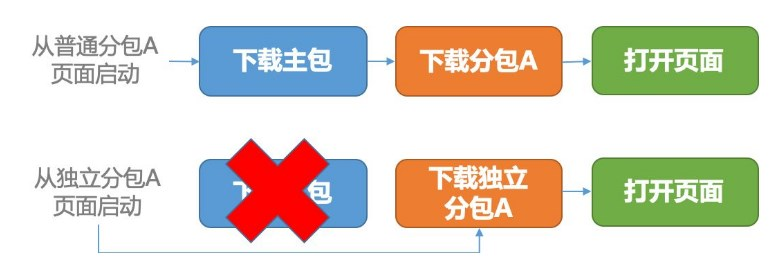
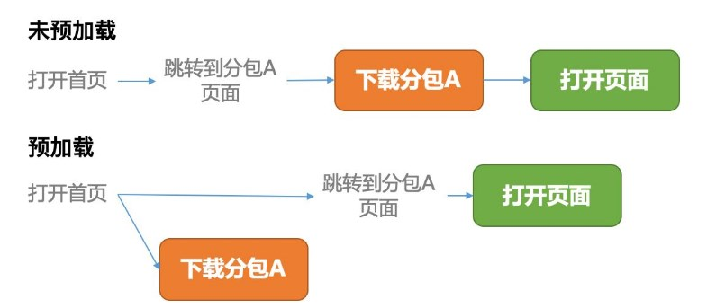

#### 启动过程优化

##### 分包加载

- 分包加载：在小程序构建时，app.json中tabBar配置的页面会形成一个主包，主包下可能有多个分包，由开发者配置。整个小程序所有分包大小不超过 20M，单个分包/主包大小不能超过 2M。分包配置如下

```js
// app.json
{
  "pages":[
    "pages/index",
    "pages/logs"
  ],
  "subpackages": [
    {
      "root": "packageA",
      "pages": [
        "pages/cat",
        "pages/dog"
      ]
    }, {
      "root": "packageB",
      "name": "pack2",
      "pages": [
        "pages/apple",
        "pages/banana"
      ]
    }
  ]
}

// 对应目录结构
├── app.js
├── app.json
├── app.wxss
├── packageA
│   └── pages
│       ├── cat
│       └── dog
├── packageB
│   └── pages
│       ├── apple
│       └── banana
├── pages
│   ├── index
│   └── logs
└── utils
```

- 独立分包：例如活动页、支付页这样相对独立且对启动性能要求高的场合，可以拆分为独立分包，加载时不依赖主包和其他分包。独立分包有一定的限制，代码中不能依赖插件、主包和其他分包



- 分包预加载：跳转到分包内页面时提前进行加载，由于手机资源有限，同一个分包中的页面预下载总大小不得超过2M



##### 组件和插件合理使用

避免非必要的全局自定义组件和插件，移除usingComponents声明的未使用的组件

##### 控制代码包内的资源文件

小程序背景图仅支持网络图片，避免使用base64去处理体积过大的图片

##### 按需注入和用时注入

- 按需注入：通过配置支持按需注入，默认会注入启动页面依赖的所有代码包中的js代码

- 用时注入：可以指定一部分自定义组件不在小程序启动时注入，而是在真正渲染的时候才进行注入

##### 减少阻塞启动过程中同步调用的生命周期

启动过程中App.onLaunch, App.onShow, Page.onLoad, Page.onShow顺序同步调用，在这些生命周期中要减少如getSystemInfo、getSystemInfoSync、setStorageSync这样同步API的调用，也要避免过于复杂的逻辑计算，防止阻塞

##### 初始渲染缓存

项目冷启动进入第一个页面时，逻辑层初始化时间长，可能造成白屏现象。启用初始渲染缓存，可以使视图层不需要等待逻辑层初始化完毕，而直接提前将页面初始 data 的渲染结果展示给用户，支持静态初始渲染缓存、在初始渲染缓存中添加动态内容两种方式

##### 提前首屏数据请求

- 在 Page.onLoad 或更早的时机发起网络请求

- 数据预拉取：预拉取能够在小程序冷启动的时候通过微信后台提前向第三方服务器拉取业务数据，当代码包加载完时可以更快地渲染页面，减少用户等待时间，从而提升小程序的打开速度

- 周期性更新：在用户未打开小程序的情况下，也能从服务器提前拉取数据，当用户打开小程序时可以更快地渲染页面

##### 骨架屏

在页面完全渲染之前，通过一些灰色的区块大致勾勒出轮廓，待数据加载完成后，再替换成真实的内容

##### 合理规划版本发布

每次版本更新会经历代码包增量更新、重新获取小程序基础信息、重新生成初始渲染缓存等过程，增加了启动耗时，因此要控制版本发布的频率

#### 运行时性能优化

##### 合理使用setData

- data 应只包括渲染相关的数据，和渲染无关的数据可以直接挂到this下
- 控制 setData 的频率，避免逻辑层和渲染层频繁通信造成页面卡顿
- 合并连续调用的setData
- 选择合适的 setData 范围，减少不必要的渲染，可以封装为独立的组件
- setData 应只传发生变化的数据
- 控制后台态页面的 setData

##### 渲染性能优化

- 适当监听页面或组件的 scroll 事件：scroll 事件会以很高的频率从视图层发送到逻辑层，开销较大
- 动画：借助css、wxs等方式生成动画，尽量不使用setData
- 控制 WXML 节点数量和层级

##### 页面切换优化

- 避免在 onHide/onUnload 执行耗时操作
- 提前发起数据请求：可以在当前页面提前获取数据后传递给目标页面
- 控制预加载下个页面的时机：默认当前页面 onReady 触发 200ms 后触发预加载渲染层的操作，可配置

##### 资源加载优化

- 控制图片资源的大小
- 减少使用image 组件的 widthFix/heightFix 模式，该模式会在图片加载完成后动态改变宽高，会造成重排

##### 内存优化

内存泄露问题会导致小程序在运行过程中内存占用持续增长，引起小程序闪退或被被微信强制销毁

- 长期持有小程序实例，导致页面无法正常销毁，如页面示例被未解绑的事件引用、被全局变量引用、被异步回调中长时间引用，应及时解除引用
- 事件监听结束后，应及时解绑监听器
- 定时器及时清理