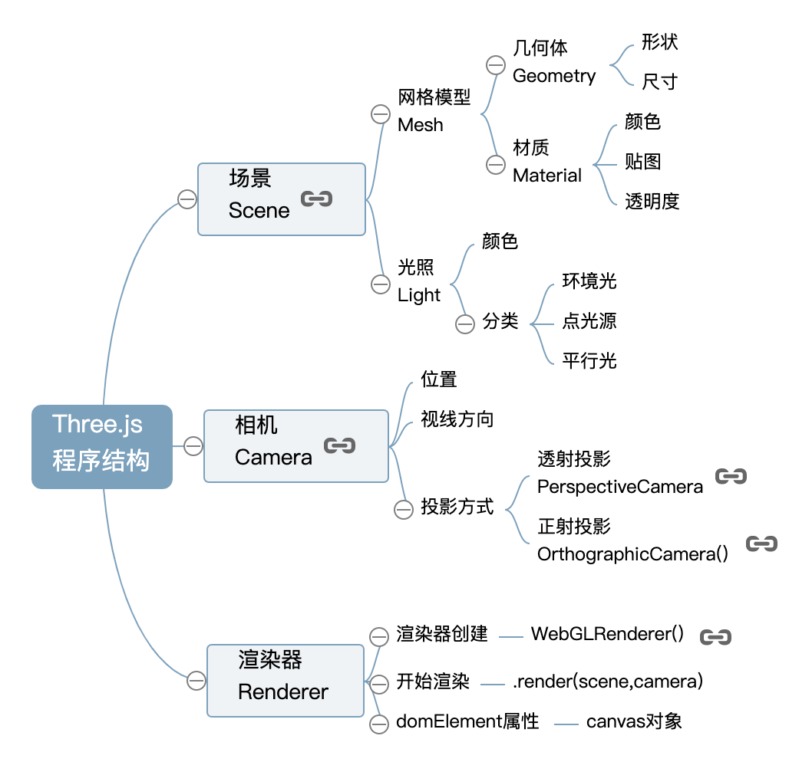

Threejs 是对 webgl 的封装，有以下几个基本要素

- 场景：定义一个三维空间

  - 网格模型：用来创建物体，包括形状、颜色、贴图等信息。webgl 中的物体都有三角形组成，这里的网格指的是由三角形组成的网格
  - 光照

- 相机：也就是所谓的观察者，定义视点、目标观察点、上方向等可视空间信息和包括正射、透视的投影方式

- 渲染器：进行绘制，相当于调用了 drawArrays 或 drawElements



一个基本的渲染流程代码如下

```js
/**
 * 创建场景对象Scene
 */
var scene = new THREE.Scene();

/**
 * 创建网格模型
 */
var geometry = new THREE.BoxGeometry(100, 100, 100); //创建一个立方体几何对象Geometry
var material = new THREE.MeshLambertMaterial({
  color: 0x0000ff,
}); //材质对象Material
var mesh = new THREE.Mesh(geometry, material); //网格模型对象Mesh
scene.add(mesh); //网格模型添加到场景中

/**
 * 光源设置
 */
//点光源
var point = new THREE.PointLight(0xffffff);
point.position.set(400, 200, 300); //点光源位置
scene.add(point); //点光源添加到场景中
//环境光
var ambient = new THREE.AmbientLight(0x444444);
scene.add(ambient);

/**
 * 相机设置
 */
var width = window.innerWidth; //窗口宽度
var height = window.innerHeight; //窗口高度
var k = width / height; //窗口宽高比
var s = 200; //三维场景显示范围控制系数，系数越大，显示的范围越大
//创建相机对象
var camera = new THREE.OrthographicCamera(-s * k, s * k, s, -s, 1, 1000);
camera.position.set(200, 300, 200); //设置相机位置
camera.lookAt(scene.position); //设置相机方向(指向的场景对象)

/**
 * 创建渲染器对象
 */
var renderer = new THREE.WebGLRenderer();
renderer.setSize(width, height); //设置渲染区域尺寸
renderer.setClearColor(0xb9d3ff, 1); //设置背景颜色
document.body.appendChild(renderer.domElement); //body元素中插入canvas对象
//执行渲染操作   指定场景、相机作为参数
renderer.render(scene, camera);
```

实际开发中可能并不需要手动写一个 3d 场景，可能由 3d 工程师使用 3dmx 等软件创建的三维模型文件，threejs 也支持直接导入这些文件

参考

1. [Three.js 教程](http://www.webgl3d.cn/Three.js/)
