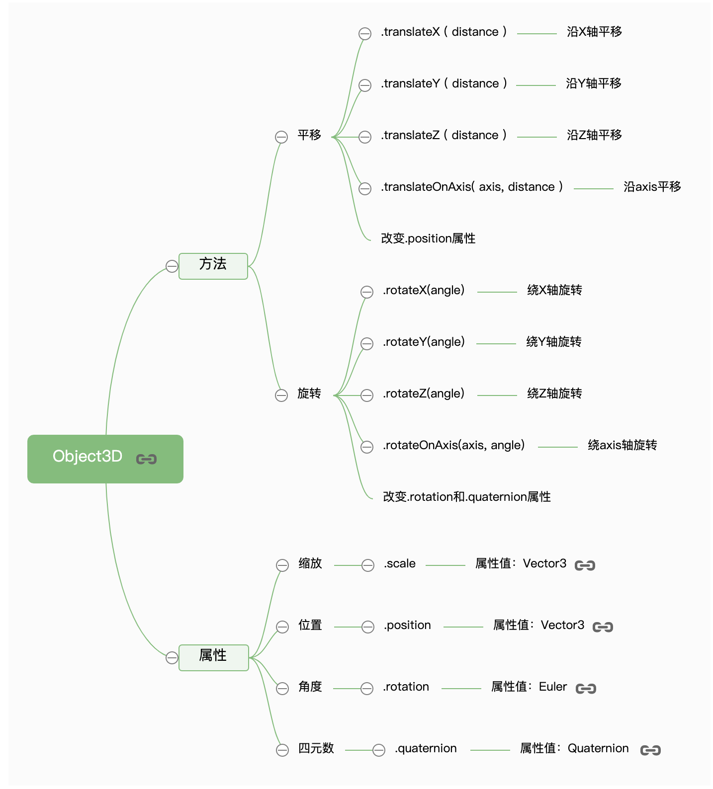

Threejs 模型对象就是由 Threejs 几何体 Geometry 和 Threejs 材质 Material 构成

#### 模型对象类型

- 点模型

```js
var geometry = new THREE.BoxGeometry(100, 100, 100); //创建一个立方体几何对象Geometry
// 点渲染模式
var material = new THREE.PointsMaterial({
  color: 0xff0000,
  size: 5.0, //点对象像素尺寸
}); //材质对象
var points = new THREE.Points(geometry, material); //点模型对象
```

- 线模型

```js
var geometry = new THREE.BoxGeometry(100, 100, 100); //创建一个立方体几何对象Geometry
// 线条渲染模式
var material = new THREE.LineBasicMaterial({
  color: 0xff0000, //线条颜色
}); //材质对象
// 创建线模型对象   构造函数：Line、LineLoop、LineSegments
var line = new THREE.Line(geometry, material); //线条模型对象
```

- 网格模型

```js
var geometry = new THREE.BoxGeometry(100, 100, 100);
// 三角形面渲染模式
var material = new THREE.MeshLambertMaterial({
  color: 0x0000ff, //三角面颜色
}); //材质对象
var mesh = new THREE.Mesh(geometry, material); //网格模型对象Mesh
```

- 精灵模型

大量精灵模型对象模拟一个粒子系统，实现下雨或下雪的渲染效果，不需要创建几何体对象

```js
var texture = new THREE.TextureLoader().load('sprite.png');
// 创建精灵材质对象SpriteMaterial
var spriteMaterial = new THREE.SpriteMaterial({
  color: 0xff00ff, //设置精灵矩形区域颜色
  rotation: Math.PI / 4, //旋转精灵对象45度，弧度值
  map: texture, //设置精灵纹理贴图
});
// 创建精灵模型对象，不需要几何体geometry参数
var sprite = new THREE.Sprite(spriteMaterial);
scene.add(sprite);
// 控制精灵大小，比如可视化中精灵大小表征数据大小
sprite.scale.set(10, 10, 1);
```

#### 模型对象变换

以上这些模型都继承自父类 Object3D，Object3D 拥有一些平移、旋转、缩放的 api


