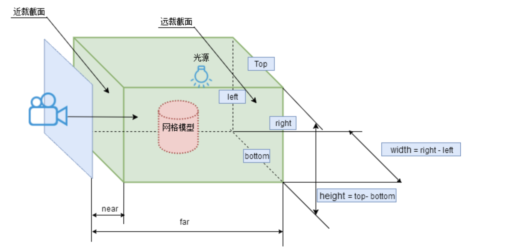

Threejs 常用的相机对象就是正投影相机 OrthographicCamera 和透视投影相机 PerspectiveCamera，本质上都是对视图矩阵和投影矩阵的封装

#### 正投影相机

正射投影会建立一个长方体的可视空间，物体显示的大小与位置无关，用于机械、工业设计领域

```js
var width = window.innerWidth; //窗口宽度
var height = window.innerHeight; //窗口高度
var k = width / height; //窗口宽高比
var s = 150; //三维场景显示范围控制系数，系数越大，显示的范围越大
//创建相机对象
var camera = new THREE.OrthographicCamera(-s * k, s * k, s, -s, 1, 1000);
camera.position.set(200, 300, 200); //设置相机位置
camera.lookAt(scene.position);
```



#### 透视投影相机

透视投影会使越远的物体看上去越小

```js
var width = window.innerWidth; //窗口宽度
var height = window.innerHeight; //窗口高度
/**透视投影相机对象*/
var camera = new THREE.PerspectiveCamera(60, width / height, 1, 1000);
camera.position.set(200, 300, 200); //设置相机位置
camera.lookAt(scene.position); //设置相机方向(指向的场景对象)
```


#### 自适应

当全屏渲染的时候，为了适应窗口的大小变化，要重新设置相机对象和渲染器对象的参数

```js
window.onresize = function () {
  // 重置渲染器输出画布canvas尺寸
  renderer.setSize(window.innerWidth, window.innerHeight);
  k = window.innerWidth / window.innerHeight; //窗口宽高比

  // 透视投影相关参数变化
  // camera.aspect = k;

  // 正射投影相关参数变化
  camera.left = -s * k;
  camera.right = s * k;
  camera.top = s;
  camera.bottom = -s;
  // 渲染器执行render方法的时候会读取相机对象的投影矩阵属性projectionMatrix
  // 但是不会每渲染一帧，就通过相机的属性计算投影矩阵(节约计算资源)
  // 如果相机的一些属性发生了变化，需要执行updateProjectionMatrix ()方法更新相机的投影矩阵
  camera.updateProjectionMatrix();
};
```
