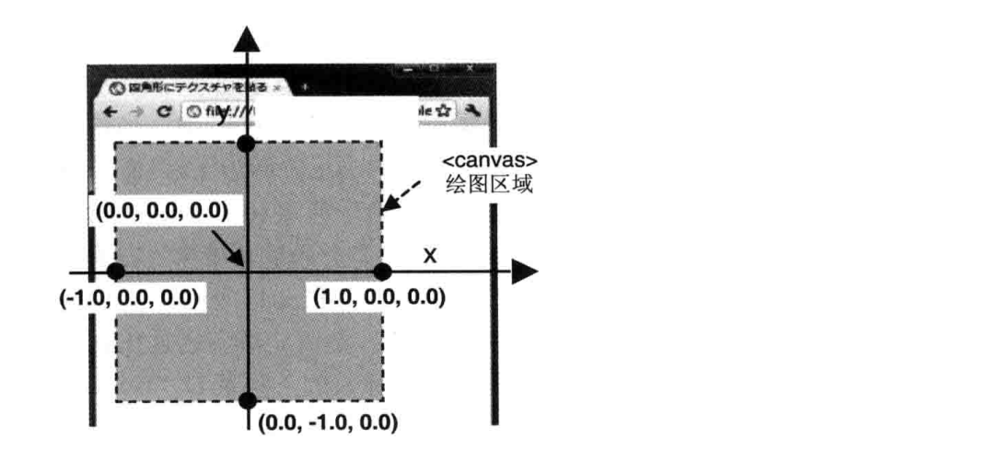

#### 坐标系分类

- 模型坐标系

一个物体通常由很多点构成，每个点在模型的什么位置需要用一个坐标系来参照，这个坐标系就叫模型坐标系，模型坐标系原点通常在模型的中心，各个坐标轴遵循右手坐标系，即 X 轴向右，Y 轴向上，Z 轴朝向屏幕外

- 世界坐标系

创建好的模型需要放置在世界中的各个位置，默认情况模型坐标系和世界坐标系重合，如果模型不在世界坐标系中心，那么就需要对模型坐标系进行转换。世界坐标系也是遵循右手坐标系

- 观察坐标系

人眼或者摄像机看到的世界中的物体相对于他自身的位置所参照的坐标系就叫观察坐标系或相机坐标系，通过改变观察位置可以看到整个 3D 空间的不同部分

- 裁剪坐标系

裁剪坐标是将相机坐标进行投影变换后得到的坐标，也就是 gl_Position 接收的坐标，遵循左手坐标系，即 X 轴向右，Y 轴向上，Z 轴朝向屏幕内。裁剪坐标系希望所有的坐标落在一个特点的范围内，不在范围内的坐标就被裁减掉不显示

- 设备（NDC） 坐标系

所有顶点被变换到裁剪空间后，GPU 会对裁剪坐标执行透视除法，顶点坐标的 X，Y，Z 分量分别除以齐次 W 分量，将裁剪坐标系转为 NDC 坐标系，最终所有坐标分量的范围都会在【-1，1】之间，坐标系原点在正方体中心，遵循左手坐标系

- 屏幕坐标系

GPU 会将 NDC 坐标映射到屏幕空间中

#### 坐标转换过程

webgl 中将模型渲染到屏幕上经历了以下过程

1. 顶点在模型坐标系中的坐标经过模型变换，转换到世界坐标系中，一般这两者是重合的

2. 然后通过摄像机观察这个世界，将物体从世界坐标系中转换到观察坐标系

3. 之后进行投影变换，将物体从观察坐标系中转换到裁剪坐标系

```c
gl_Position = vec4(x, y, z, 1);
```

4. GPU 接收裁剪坐标，通过透视除法，将裁剪坐标转换成 NDC 坐标

5. GPU 将 NDC 坐标通过视口变换，渲染到屏幕上

#### 坐标变换计算

以一个顶点 P 为例，该顶点在边长为 3 的正方体上，初始时顶点所在坐标系是模型坐标系，也就是相对于正方体中心位置，坐标为（3，3，0）

##### 模型坐标转换为世界坐标

默认情况下世界坐标和模型坐标是一致的，如果物体经过平移、旋转、缩放等变换就会发生变化，使用变换矩阵可以计算出顶点经某个变换后的坐标，多个变换矩阵合起来称为模型矩阵。假设将该物体先平移，再旋转，最后缩放

```
<模型矩阵> = <平移变换矩阵> * <旋转变换矩阵> * <缩放变换矩阵>
```

现在顶点的坐标为

```
<顶点坐标> = <模型矩阵> * <原始顶点坐标>
```

这里需要引入齐次坐标的概念。3 维坐标再加一维就变成了齐次坐标，用来区分点与向量，新增维度的值为 0 则代表向量，不为 0 则代表点。比如给一个分量(a,b,c)，并不知道这是向量还是点，分情况看一下

- 如果是向量 v，存在坐标(v1,v2,v3)，使得 v = v1 \* a + v2 \* b + v3 \* c
- 如果是点 v，存在坐标(v1,v2,v3)，使得 v - o = v1 \* a + v2 \* b + v3 \* c，把点看作是基的原点进行了位移，所以相比于向量就需要额外的信息进行表示

##### 世界坐标转换为观察坐标

整个场景会因为视点、观察目标点、上方向的不同，所看到的景象也不同，这三者组成一个视图矩阵，经观察者观察后现在的顶点坐标为

```
<顶点坐标> = <视图矩阵> * <模型矩阵> * <原始顶点坐标>
```

##### 观察坐标转换为裁剪坐标

wegbl 只绘制可视范围内的三维对象，超出可视空间的部分会被裁减，包括水平视角、垂直视角、可见深度，这三者构成了可视空间，然后通过正射投影或透视投影将 3d 坐标映射到 2d 的平面上，裁剪后的顶点坐标为

```
<顶点坐标> = <投影矩阵> * <视图矩阵> * <模型矩阵> * <原始顶点坐标>
```

其中正射投影矩阵需要已知上下左右边界和远近裁剪面的位置，透视投影矩阵需要已知可视空间底面和顶面的夹角、近裁剪面宽高比和远近裁剪面的位置

##### 裁剪坐标转换为 NDC 坐标

NDC 坐标是在 GPU 中 将裁剪坐标执行透视除法，其中经过正射投影矩阵映射后的坐标 w 分量不会改变，始终是 1；透视投影矩阵会产生近大远小的效果，透视除法要求顶点坐标的每个分量除以它的 W 分量

> 这个过程由顶点着色器内部完成，无法干预

##### NDC 坐标转换为屏幕坐标

转换成屏幕坐标时要绘制到对应的 canvas 中，canvas 的坐标系和 webgl 的坐标系有所不同，canvas 的中心点是 webgl 坐标系的原点，而 canvas 的原点在左上角，需要作一些平移变换



这个过程由 GPU 内部完成，无法干预

参考

1. [中级进阶 --- WebGL 坐标系](https://juejin.cn/book/6844733755580481543/section/6844733755937013773)
