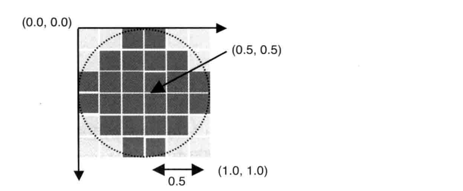

#### 选中物体

分以下几步

1. 鼠标按下时将物体绘制成单一的颜色
2. 读取点击处的像素颜色
3. 使用物体原来的颜色进行重绘，为防止颜色变化引起的闪烁，取出颜色后立刻重绘，而不是等到下一帧

部分代码如下

```c
// 顶点着色器
// ...
uniform bool u_Clicked;
void main() {
    // ...
    if (u_Clicked) {
        v_Color = vec4(1,0,0,1);
    } else {
        v_Color = u_Color;
    }
}
```

```js
// ...
canvas.onmousedown = (e) => {
  const rect = e.target.getBoundingClientRect();
  const x = e.clientX - rect.left;
  const y = e.clientY - rect - bottom;
  const picked = check(x, y);
  if (picked) {
    // todo
  }
};

function check(x, y) {
  let picked = false;
  // 绘制成红色
  gl.uniform1i(u_Clicked, 1);
  draw();
  // 获取点击位置像素
  const pixels = new UInt8Array(4);
  // 从颜色缓冲区中读取由x、y、width、height组成的矩形块中所有像素值
  gl.readPixels(x, y, 1, 1, gl.RGBA, gl.UNSIGEND_BYTE, pixels);
  if (pixels[0] === 255) {
    picked = true;
  }
  // 使用物体原来的颜色进行重绘
  gl.uniform1i(u_Clicked, 0);
  draw();
  return picked;
}
```

如果想选中物体某个表面，也是类似的做法，需要事先将顶点所在的不同平面编号，点击时将该编号作为某个颜色分量进行绘制，然后获取像素就可以知道在哪个表面了。部分代码如下

```c
// 顶点着色器
// 。。。
attribute float a_Face; // 表面编号
uniform int u_PickedFace; // 被选中的表面编号
void main() {
    // ...
    int face = int(a_Face);
    vec3 color = face === u_PickedFace ? vec3(1,0,0): a_Color.rgb;
    if (u_PickedFace === -1) {
        v_Color = vec4(color, a_Color.a)
    } else {
        // 选中表面时将表面编号作为分量传递
        v_Color = vec4(color, a_Face/255)
    }
}
```

```js
// ...
// 表面编号，按顶点索引
const faces = new UInt8Array([
  1,
  1,
  1,
  1, // 前表面
  2,
  2,
  2,
  2, // 后表面
  // ...
]);
gl.uniform1i(u_PickedFace, -1);
// ...
canvas.onmousedown = (e) => {
  const rect = e.target.getBoundingClientRect();
  const x = e.clientX - rect.left;
  const y = e.clientY - rect - bottom;
  const face = check(x, y);
  gl.uniform1i(u_PickedFace, face);
  draw();
};

function check() {
  // 顶点着色器将颜色缓冲区的a分量改为表面编号，然后绘制
  gl.uniform1i(u_PickedFace, 0);
  draw();
  // 获取鼠标点击位置像素，得知a分量，即点击的是哪个表面
  const pixels = new UInt8Array(4);
  gl.readPixels(x, y, 1, 1, gl.RGBA, gl.UNSIGEND_BYTE, pixels);
  return pixels[3];
}
```

#### 雾化

实现雾化的方式有很多，以线性雾化为例，线性雾化中某一点的雾化程度取决于与视点的距离，存在起点和终点，其中雾化程度可以用雾化因子来描述，取值 0-1，计算过程如下

```
<雾化因子> = (<终点> - <当前点与视点的距离>) / (<终点> - <起点>)
```

雾化的过程需要在片元着色器中处理，添加雾化效果后片元颜色的计算过程如下

```
<片元颜色> = <物体表面颜色> * <雾化因子> + <雾化颜色> * (1 - <雾化因子>)
```

部分代码如下

```c
// 顶点着色器
// ...
uniform mat4 u_ModelMatrix;
uniform vec4 u_Eye;
varying float v_Dist;
void main() {
    // 顶点与视点距离
    v_Dist = distance(u_ModelMatrix * a_Position, u_Eye);
}
// 片元着色器
// ...
uniform vec3 u_FogColor; // 雾化颜色
uniform vec2 u_FogDist; // 雾化起点和终点
varying float v_Dist;
void main() {
  // 计算雾化因子
  float fogFactor = clamp((u_FogDist.y - v_Dist) / (u_FogDist.y - u_FogDist.x), 0, 1);
  vec3 color = mix(u_FogColor, vec3(v_Color), fogFactor);
  gl_FragColor = vec4(color, v_Color.a)
}
```

```js
// ...
const fogColor = new Float32Array([0.1, 0.3, 0.3]); //雾化颜色
const fogDist = new Float32Array([55, 80]); // 雾化起点和终点
const eye = new Float32Array([25, 36, 34]); // 视点
// ...
gl.uniform3fv(u_FogColor, fogColor);
gl.uniform2fv(u_FogDist, fogDist);
gl.uniform4fv(u_Eye, eye);
```

顶点着色器中计算顶点与视点距离开销较大，可以使用 gl_Position 的 w 分量，其值为 z 分量乘以-1

```c
// 顶点着色器
// ...
void main() {
    // 顶点与视点距离
    v_Dist = gl_Position.w;
}
```

#### 绘制圆形的点

绘制圆形的点需要将方形的点削成圆形。顶点着色器和片元着色器之间发生了光栅化的过程，需要在片元着色器中改动，只绘制圆以内的像素

内置变量 gl_PointCoord 表示当前片元在所属点内的坐标，如下，可以将与点中心超过 0.5 距离的片元舍弃掉



部分代码如下

```c
// 片元着色器
// ...
void main() {
  float dist = distance(gl_PointCoord, vec2(0.5,0.5));
  if (dist < 0.5) {
    gl.FragColor = vec4(1,0,0,1)
  } else {
    // 片元舍弃
    discard;
  }
}
```

#### 混合

借助颜色的 a 分量实现透明效果称为混合。设置颜色的 a 分量为 0 到 1 的值，然后需要在绘制前开启混合

```js
// 开启混合
gl.enable(gl.BLEND);
// 设置混合函数
gl.blendFunc(gl.SRC_ALPHA, gl.ONE_MINUS_SRC_ALPHA);
```

webgl 混合时用到了两种颜色：源颜色和目标颜色，即把目标颜色混入到源颜色中，混合函数用来设置源颜色和目标颜色在混合颜色中的权重

混合时需要关闭隐藏面消除，否则不会生效。实际上通过以下步骤可以实现隐藏面消除和半透明效果共存

1. 开启隐藏面消除
2. 绘制所有不透明物体
3. 锁定用于隐藏面消除的深度缓冲区的写入操作，使其只读
4. 绘制所有半透明物体，按深度顺序（z 轴）从后向前绘制
5. 释放深度缓冲区，使其可写
