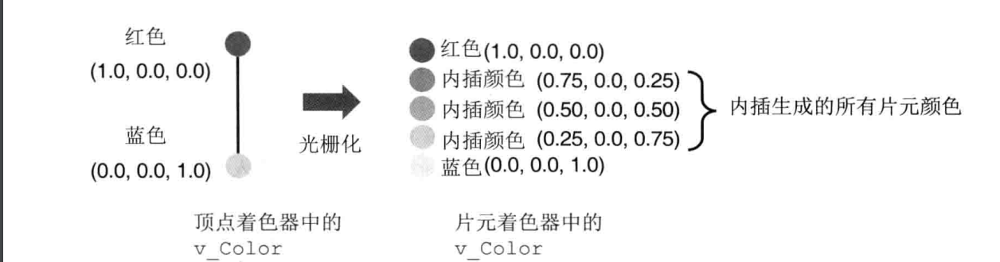
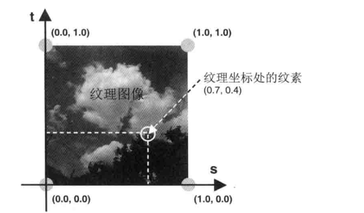

#### varying 变量的作用

借助 varying 变量可以从顶点着色器向片元着色器传递数据，并经历了插值过程。假如一条线段，在顶点着色器中赋给端点两个不同的颜色，webgl 会自动计算出线段上所有点的颜色，并赋值给片元着色器对应的 varying 变量，这就是插值的过程



#### 纹理坐标

纹理也有一套自己的坐标系统，称为纹理坐标系，左下角为原点(0, 0)，向右为横轴正方向，横轴坐标范围【1，0】；向上为纵轴正方向，纵轴坐标范围【0，1】



#### 着色器代码

顶点着色器接收顶点的 纹理 坐标，并将 纹理 坐标传递给片元着色器。片元着色器接收顶点插值后的纹理坐标，同时能够在纹理资源找到对应坐标的颜色值。

```js
// 顶点着色器
precision mediump float;
// 接收顶点坐标 (x, y)
attribute vec2 a_Position;
// 接收 canvas 尺寸(width, height)
attribute vec2 a_Screen_Size;
// 接收JavaScript传递过来的顶点 uv 坐标。
attribute vec2 a_Uv;
// 将接收的uv坐标传递给片元着色器
varying vec2 v_Uv;
void main(){
    vec2 position = (a_Position / a_Screen_Size) * 2.0 - 1.0;
    position = position * vec2(1.0,-1.0);
    gl_Position = vec4(position, 0, 1);
    // 将接收到的uv坐标传递给片元着色器
    v_Uv = a_Uv;
}

// 片元着色器
// 接收顶点着色器传递过来的 uv 值。
varying vec2 v_Uv;
// 接收 JavaScript 传递过来的纹理
uniform sampler2D texture;
void main(){
    // 提取纹理对应uv坐标上的颜色，赋值给当前片元（像素）。
    gl_FragColor = texture2D(texture, vec2(v_Uv.x, v_Uv.y));
}
```

其中内置函数 texture2D 用来根据纹理对象抽取纹素颜色

#### js 代码

```js
var positions = [
  30,
  30,
  0,
  0, //V0
  30,
  300,
  0,
  1, //V1
  300,
  300,
  1,
  1, //V2
  30,
  30,
  0,
  0, //V0
  300,
  300,
  1,
  1, //V2
  300,
  30,
  1,
  0, //V3
];
var img = new Image();
img.src = 'test.png';
img.onload = () => {
  // y轴反转，纹理坐标的y轴与图片中的坐标系统的y轴方向相反
  gl.pixelStore(gl.UNPACK_FILP_Y_WEBGL, 1);
  // 激活 0 号纹理通道gl.TEXTURE0
  gl.activeTexture(gl.TEXTURE0);
  // 创建一个纹理对象
  var texture = gl.createTexture();
  // 绑定 到当前纹理绑定点上，绑定完之后对当前纹理对象的所有操作，都将基于 texture 对象
  gl.bindTexture(gl.TEXTURE_2D, texture);
  // 将纹理图像分配给纹理对象
  /* 
  target：纹理类型，TEXTURE_2D代表2维纹理
  level：表示多级分辨率的纹理图像的级数，若只有一种分辨率，则 level 设为 0
  components：纹理通道数，通常我们使用 RGBA 和 RGB 两种通道
  width：宽，可省略
  height：高，可省略
  border：边框，可省略
  format：纹理映射的格式
  type：纹理映射的数据类型
  pixels：纹理图像的数据
   */
  gl.texImage2D(gl.TEXTURE_2D, 0, gl.RGBA, gl.RGBA, gl.UNSIGNED_BYTE, img);
  // 设置图片在放大或者缩小时采用的算法gl.LINEAR
  gl.texParameterf(gl.TEXTURE_2D, gl.TEXTURE_MAG_FILTER, gl.LINEAR);
  gl.texParameterf(gl.TEXTURE_2D, gl.TEXTURE_MIN_FILTER, gl.LINEAR);
  // 为片元着色器传递 0 号纹理单元
  var uniformTexture = gl.getUniformLocation(gl.program, 'texture');
  gl.uniform1i(uniformTexture, 0);
};
```

webgl 通过纹理单元来使用多个纹理，每个纹理单元对应一个单元编号，默认情况下 webgl 至少支持 8 个纹理单元，并使用 gl.activeTexture 激活

```js
// textUnit取值为gl.TEXTURE0、gl.TEXTURE1...gl.TEXTURE7
gl.activeTexture(textUnit);
```

创建纹理对象并绑定后，可以配置纹理映射到图形上的具体方式，即 texParameterf 的第二个参数

- gl.TEXTURE_MAG_FILTER：纹理放大
- gl.TEXTURE_MIN_FILTER：纹理缩小
- gl.TEXTURE_WRAP_S：纹理水平填充
- gl.TEXTURE_WRAP_T：纹理水平填充

总结一下设置纹理经历以下几个步骤

1. 准备好映射到图形上的纹理图像并加载，WebGL 对纹理图片素材是有严格要求的，图片的宽度和高度必须是 2 的 N 次幂
2. y 轴反转并激活纹理通道，创建纹理对象并绑定，并为图形配置纹理映射方式
3. 将纹理图像分配给纹理对象，然后将纹理单元传给片元着色器
4. 在片元着色器中将纹素从纹理中抽取处理，将纹素的颜色赋值给片元。纹素是指组成纹理图像的像素

参考

1. [初级入门 --- 纹理贴图：为形体穿上外衣](https://juejin.cn/book/6844733755580481543/section/6844733755924414471)
