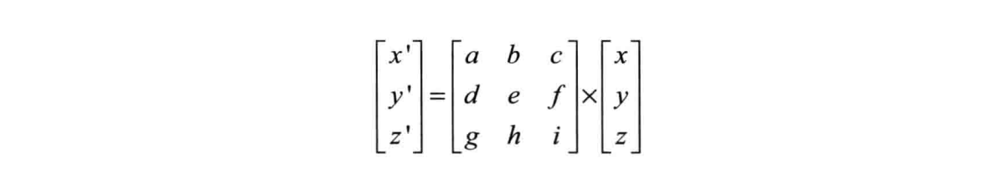
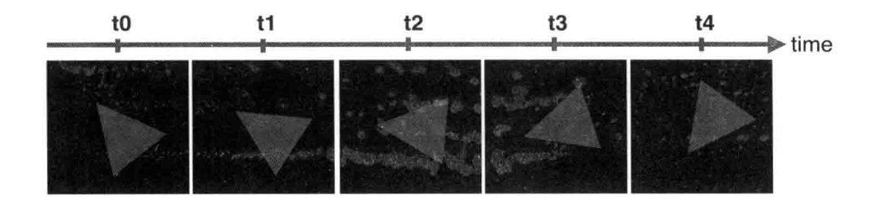

#### 平移

一个点移动到另一个点需要将各个分量加上对应方向所移动的分量。假设 P(x,y,z)平移到 P'(x',y',z')，两点的沿各个轴的距离分别为 tx、ty、tz

```
x' = x + tx;
y' = y + ty;
z' = z + tz;
```

这是一个逐顶点操作，需要在顶点着色器中处理

```c
// 顶点着色器
attribute vec4 a_Position;
uniform vec4 u_Transition;
void main() {
    gl_Position = a_Position + u_Transition;
}
```

```js
const u_Transition = gl.getUniformLocation(gl.program, 'u_Transition');
// 将平移距离传递给该顶点着色器
gl.uniform4f(u_Transition, 0.5, 0.5, 0, 0.0);
```

gl.uniform4f 接收的是一个齐次坐标，为保证 gl_Position 第四个分量为 1，u_Transition 第四个分量需要为 0

#### 旋转

描述一个旋转需要指明旋转轴、旋转方向、旋转角度

> webgl 中逆时针的约定是，观察者处于 z 轴正半轴某处，视线沿 z 轴负半轴进行观察，旋转了正角度（从 x 正半轴开始计算）

假设 P(x,y,z)绕 z 轴旋转 b 角度到 P'(x',y',z')，推导 P'坐标的过程如下，假设 P 到原点的距离 r，夹脚 a

```
x = r * cos a;
y = r * sin a;
x' = r * cos (a + b) = r * (cos a * cos b - sin a * sin b) = x * cos b - y * sin b;
y' = r * sin (a + b) = r * (sin a * cos b + sin b * cos a) = x * sin b + y * cos b;
z' = z
```

代码如下

```c
// 顶点着色器
attribute vec4 a_Position;
uniform float u_CosB, u_SinB;
void main() {
    gl_Position.x = a_Position.x * u_CosB - a_Position.y * u_SinB;
    gl_Position.y = a_Position.x * u_SinB + a_Position.y * u_CosB;
    gl_Position.z = a_Position.z;
    gl_Position.w = 1.0;
}
```

```js
// 旋转角度
const DGE = 50;
// 转为弧度
const radian = (Math.PI * DGE) / 180;
const cos = Math.cos(radian);
const sin = Math.sin(radian);

const u_CosB = gl.getUniformLocation(gl.program, 'u_CosB');
gl.uniform1f(u_CosB, cos);

const u_SinB = gl.getUniformLocation(gl.program, 'u_SinB');
gl.uniform1f(u_SinB, sin);
```

借助变换矩阵可以简化平移、旋转、缩放的坐标变换过程，现在假设 P(x,y,z)通过某种方式变换到 P'(x',y',z')，变换矩阵如下



转换如下

```
x' = a * x + b * y + c * z;
y' = d * x + e * y + f * z;
z' = g * x + h * y + i * z;
```

以上述的旋转为例，易得旋转矩阵如下，注意不要忽略 w 分量

```
cos b  -sin b  0  0
sinb   cos b   0  0
0      0       1  0
0      0       0  1
```

代码修改如下

```c
// 顶点着色器
attribute vec4 a_Position;
uniform mat4 u_Mat4;
void main() {
    gl_Position.x = u_Mat4 * a_Position;
}
```

```js
// 旋转角度
const DGE = 50;
// 转为弧度
const radian = (Math.PI * DGE) / 180;
const cos = Math.cos(radian);
const sin = Math.sin(radian);
const mat4 = new Float32Array([
    cos b,  -sin b,  0,  0,
    sinb,   cos b,   0,  0,
    0,      0,       1,  0,
    0,      0,       0,  1,
]);
const u_Mat4 = gl.getUniformLocation(gl.program, 'u_Mat4');
gl.uniform1f(u_Mat4, mat4);
```

#### 缩放

假设 P(x,y,z)缩放到 P'(x',y',z')，已知缩放因子 sx、sy、sz

```
x' = x * sx;
y' = y * sy;
z' = z * sz;
```

易得变换矩阵后，和旋转中变换矩阵的代码是类似的

```
sx  0  0  0
0   sy 0  0
0   0  sz 0
0   0  0  1
```

实际应用中可能存在多种变换方式叠加的可能，手动计算变换矩阵非常复杂，可以借助 cuon-matrix-ts 库来计算

#### 欧拉角

上述的旋转方式最终都生成一个旋转变换矩阵来进行计算，直接给出一个旋转矩阵很难看懂物体是如何旋转的，为了直观的看出旋转方式，可以采用欧拉角表示。欧拉角是飞控系统中用于描述飞行器姿态的方式，使用三个角度来表示

- pitch：俯仰角，是指飞行器机头抬起的角度，对应绕着 X 轴旋转的角度 β
- yaw：偏航角，是指飞行器偏离原来航线的角度，对应绕着 Y 轴旋转的角度 α
- roll：滚转角，是指飞行器绕着自身头尾轴线翻滚的角度，对应绕着 Z 轴旋转的角度 γ

欧拉角有不同的旋转顺序，如 xyz、xyx 等，以 xyz 顺序的欧拉角为例，可以理解为

- 参照自身坐标系，先绕 X 轴旋转，再绕 Y 轴旋转，最后绕 Z 轴旋转
- 参照世界坐标系，先绕 Z 轴旋转，再绕 Y 轴旋转，最后绕 X 轴旋转

以自身坐标系为例，根据欧拉角推导旋转矩阵的过程如下

```
<变换矩阵> = <旋转矩阵x> * <旋转矩阵y> * <旋转矩阵z>;
```

欧拉角主要缺陷是会产生万向节死锁，当第二个旋转轴旋转 90 度时，会导致第三个旋转轴和第一个旋转轴重合，此时如果继续绕第三个旋转轴，相当于在第一个旋转轴上旋转。万向节死锁会导致动画路径怪异、连续增量旋转时姿态不准确等问题，需要限制第二个旋转角范围在-90 到+90 之间

#### 四元数

可以将欧拉旋转或者轴角旋转转换成易于线性插值的四元数，四元数包含一个实数和三个复数

```c
// 表示方法
q = (w,x,y,z);
q = w + xi + yj + zk;
// 还可以表示为实数w和向量u(x,y,z)
q = (w, u)
```

一个四元数可以代表一个旋转过程，先将原向量表示为四元数 q0=(0,v) ，将旋转角度和旋转轴的信息用单位四元数 q 表示

```c
// 绕轴 u 旋转 2 * θ 角度
q = cos θ + u * sin θ
```

#### 动画

生成动画需要两个关键点：每个时刻反复调用绘制的逻辑；每次绘制之前，清除上次绘制的内容，并作出相应的变换



实现一个不断旋转的三角形，主要代码如下

```js
// 旋转速度
const ROTATO_SPEED = 45;
let last_time = Date.now();
function animate(angle) {
  const now = Date.now();
  const interval = now - last_time;
  last_time = now;
  return (angle + (ROTATO_SPEED + interval) / 1000) % 360;
}

function draw(angle, u_ModelMatrix, modelMatrix, n) {
  modelMatrix.setRotate(angle, 0, 0, 1);
  gl.uniformMatrix4fv(u_ModelMatrix, false, modelMatrix.elements);
  // 清除canvas
  gl.clear(gl.COLOR_BUFFER_BIT);
  gl.drawArrays(gl.TRIANGLES, 0, n);
}

function main() {
  // 设置背景色
  gl.clearColor(0, 0, 0, 1);
  const u_ModelMatrix = gl.getUniformLocation(gl.program, 'u_ModelMatrix');
  // ...
  let currentAngle = 0;
  // 借助cuon-matrix-ts 库计算变换矩阵
  const modelMatrix = new Matrix4();
  const tick = () => {
    currentAngle = animate(animate);
    draw(currentAngle, u_ModelMatrix, modelMatrix, 3);
    requestAnimationFrame(tick);
  };
}
main();
```
